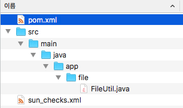
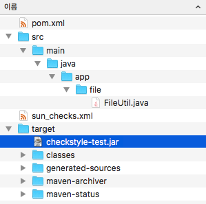

## 개요

이전 포스트에서 체크스타일의 기본 개념과 설정방법을 공부해보았다. 지금까지 배운 방법을 이용하여 자신의 소스를 검사할수 있다. 하지만 아직 뭔가 부족하다. 소스를 검사할때 마다 터미널창을 열어 직접 명령을 수행해야 할까? 소스를 검사하는 것을 자동화할수 없을까? 

이런 질문에 답을주는 것이 바로 메이븐 체크스타일 플러그인이다.

> 이 포스트를 읽기전에 메이븐에 대한 사전 지식이 필요하다. 메이븐은 자바개발 환경을 자동화 하는 매우 유용한 도구이다.

## 메이븐 체크스타일 플러그인

체크스타일 플러그인은 체크스타일 라이브러리를 이용하여 소스를 검사하고 보고서를 작성하도록 도와주는 역할을 한다. 또한 메이븐의 pom파일을 설정하는 것만으로도 체크스타일을 적용할 수 있다. 즉, 이전 포스트에서 설명한 체크스타일 라이브러리를 받고 터미널에서 명령어를 입력하는 과정은 필요없다는 이야기이다.

## 체크스타일 골(Goals)

체크스타일의 골은 3가지이다. (골은 메이븐에서 사용하는 용어인데, 익숙하지 않다면 단순히 기능이라고 생각하자) 

 * **checkstyle:checkstyle** : 소스를 분석하고 위반사항에 대한 결과를 생성한다.
 * **checkstyle:checkstyle-aggregate** : 1개 이상의 모듈을 분석하고 위반사항에 대한 결과를 HTML로 생성한다. 
 * **checkstyle:check** : 소스를 검사하고 위반사항을 콘솔에 출력한다. 

내가 사용한 골은 checkstyle:check이다. 그래서 다른 골은 어떻게 활용하는지 잘 모르겠다. 이 포스트는 check골 위주로 설명하겠다. 

## 메이븐으로 실행하기

처음 포스팅에서 사용했던 검사 대상 소스와 sun_checks.xml설정파일을 그대로 사용하여 메이븐으로 진행을 해보자. 기존에 사용했던 체크스타일 라이브러리는 없어도 된다. 왜냐하면 메이븐이 알아서 해당 라이브러리를 찾기 때문이다. 

> 이렇게 함으로써 메이븐을 사용할 때와 그렇지 않을 때의 차이점을 쉽게 알 수 있을 것이다.

### 메이븐 설치 확인

먼저 자신의 PC에 메이븐 환경이 구성됐는지 아래 명령어로 확인하자. 다음과 같이 버전 정보가 나타난다면 정상으로 메이븐을 사용할 수 있다. 

```
$ mvn --version
Apache Maven 3.6.3 (cecedd343002696d0abb50b32b541b8a6ba2883f)
Maven home: /usr/local/Cellar/maven/3.6.3_1/libexec
```

### 폴더 구성 

메이븐에서 기본으로 제시하는대로 폴더구조를 설정하자. 메이븐에서는 자바소스를 /src/main/java 폴더 이하에 배치한다. 그 다음부터 패키지명 기준으로 폴더를 생성한다. (이 부분은 메이븐과 상관없는 자바 패키지룰이다) 그리고 pom.xml 파일은 프로젝트 루트폴더에 위치한다.



### pom.xml 설정하기

체크스타일에 대한 설정보다 메이븐에 대한 설정이 더욱 많다. 기본으로 설정한 내용은 다음과 같다. 

* groupId : 프로젝트 그룹 이름을 정한다. 
* artifactId : 프로젝트 이름을 정한다. 
* packaging : 소스파일이 jar로 패키징된다. 
* finalName : 패지징되는 파일의 명칭이다.

```xml
<project xmlns="http://maven.apache.org/POM/4.0.0"
  xmlns:xsi="http://www.w3.org/2001/XMLSchema-instance"
  xsi:schemaLocation="http://maven.apache.org/POM/4.0.0 http://maven.apache.org/xsd/maven-4.0.0.xsd">
  <modelVersion>4.0.0</modelVersion>
  <groupId>my.study</groupId>
  <artifactId>checkstyle-test</artifactId>
  <version>0.0.1-SNAPSHOT</version>
  <packaging>jar</packaging>

  <build>
    <finalName>checkstyle-test</finalName>
    <plugins>
      <plugin>
        <artifactId>maven-compiler-plugin</artifactId>
        <version>3.8.0</version>
        <configuration>
          <source>1.8</source>
          <target>1.8</target>
          <encoding>UTF-8</encoding>
        </configuration>
      </plugin>
      <plugin>
        <groupId>org.apache.maven.plugins</groupId>
        <artifactId>maven-checkstyle-plugin</artifactId>
        <version>3.1.1</version>
        <configuration>
          <configLocation>sun_checks.xml</configLocation>
        </configuration>
      </plugin>
    </plugins>
  </build>
</project>
```

우리가 중점으로 봐야 하는 설정은 `<artifactId>maven-checkstyle-plugin</artifactId>` 가 있는 플러그인 설정부분인데 이 부분은 나중에 보기로 하고 일단 빌드부터 해보자. 

### 빌드 해보기

터미널을 열고 pox.xml이 위치하는 폴더로 이동하여 다음 명령어를 입력한다. 

```bash
$ mvn package
```

아래 내용이 콘솔창에 출력되면 빌드가 성공한 것이다. 

```bash
[INFO] Building jar: /Users/geonho/Documents/checkstyle/maven/target/checkstyle-test.jar
[INFO] ------------------------------------------------------------------------
[INFO] BUILD SUCCESS
[INFO] ------------------------------------------------------------------------
[INFO] Total time:  17.661 s
[INFO] Finished at: 2020-09-12T12:33:11+09:00
[INFO] ------------------------------------------------------------------------
```

빌드 후에는 `target` 폴더가 생성된다. 



빌드가 정상으로 됐으니 현재 설정이 유효하다고 검증이 된 것이다. 이제 메이븐의 체크스타일의 설정을 꼼꼼하게 설펴보자.

> pom.xml에 메이븐과 관련된 별도의 설정을 하지 않았기 때문에 모든 것은 기본 설정을 따른다. 

### 메이븐 체크스타일 플러그인 설정

체크스타일 플러그인과 관련된 설정은 더욱 간단하다. 3.1.1버전의 체크스타일을 플러그인을 사용할 것이고 설정파일은 sun_checks.xml을 사용하겠다는 설정이다. 쉽지 않은가? 메이븐 환경에서도 설정파일만 잘 가지고 있다면 큰 어려움 없이 체크스타일을 사용할 수 있다.

```xml
<plugin>
  <groupId>org.apache.maven.plugins</groupId>
  <artifactId>maven-checkstyle-plugin</artifactId>
  <version>3.1.1</version>
  <configuration>
    <configLocation>sun_checks.xml</configLocation>
  </configuration>
</plugin>
```

### 체크스타일 실행

다음 명령어로 메이븐에서 체크스타일을 실행하자. check 골을 수행하는 명령어이다.

```
$ mvn checkstyle:check
```

정상으로 동작한다면 빌드가 실패했다는 메세지가 나온다.

```bash
[INFO] ------------------------------------------------------------------------
[INFO] BUILD FAILURE
[INFO] ------------------------------------------------------------------------
[INFO] Total time:  2.445 s
[INFO] Finished at: 2020-09-12T13:16:46+09:00
[INFO] ------------------------------------------------------------------------
[ERROR] Failed to execute goal org.apache.maven.plugins:maven-checkstyle-plugin:3.1.1:check (default-cli) on project checkstyle-test: You have 11 Checkstyle violations. -> [Help 1]
```

설정이 문제가 있는 것이 아니라 빌드 실패가 발생하는 것이 정상적인 상황이다. 메이븐은 체크스타일을 실행했고 소스코드에 위반사항을 발견하고 빌드 실패 메세지를 내보낸 것이다. 이전 포스팅에서의 결과와 똑같다.

> 메세지 `You have 11 Checkstyle violations`로 보아 11개의 체크스타일 룰에 위반되는 사항이 발견되었다.

### 빌드실패 제어 하기

다음과 같이 pom.xml의 체크스타일 플러그인의 `failOnViolation`를 설정하면 위반사항이 발생해도 빌드 오류가 되지 않는다.

```xml
<configuration>
  <configLocation>sun_checks.xml</configLocation>
  <failOnViolation>false</failOnViolation>
</configuration>
```

다시 빌드를 하면 아래와 같이 빌드 실패가 발생하지 않는다.

```bash
[WARNING] checkstyle:check violations detected but failOnViolation set to false
[INFO] You have 11 Checkstyle violations.
[INFO] ------------------------------------------------------------------------
[INFO] BUILD SUCCESS
[INFO] ------------------------------------------------------------------------
[INFO] Total time:  1.984 s
[INFO] Finished at: 2020-09-12T13:57:52+09:00
[INFO] ------------------------------------------------------------------------
```

체크스타일 플러그인도 설정할 수 있는 항목이 다양하다. 무엇을 설정할 수 있고 어떤 기능을 하고 있는지는 공식 홈페이지([여기](https://maven.apache.org/plugins/maven-checkstyle-plugin/check-mojo.html#failOnViolation))를 참조하자.

## 메이븐을 쓰면 뭐가 달라지나?

메이븐을 이용하여 체크스타일을 실행 해봤는데 메이븐을 이용하면 뭐가 달라지는 걸까? 대부분은 자바로 개발을 할 때 라이브러리 의존성 설정과 빌드 도구로 메이븐을 이용한다. 메이븐은 설정파일의 내용대로 필요한 라이브러리를 원격리포지토리에서 받고 소스를 컴파일한다. 또한 컴파일된 소스를 jar 또는 war파일로 패키징한다. 개발자는 단순히 mvn으로 시작하는 메이븐 명령어 한 줄이면 이 모든것이 이루어지는 것이다. 

체크스타일의 기본라이브러리를 사용한다면 메이븐의 빌드 프로세스와는 별도로 체크스타일 라이브러리를 받고 설정파일을 실행하는 작업이 필요하다. 하지만 체크스타일 메이븐 플러그인을 사용하면 기존에 사용하던 메이븐 빌드 프로세스에 그대로 체크스타일 수행과정을 추가할 수 있다. 다음 명령어를 입력해보자. 

```bash
$ mvn clean checkstyle:check package
```

위의 명령어는 기존의 빌드된 파일들을 모두 삭제하고(클린) 체크스타일을 실행한 후 소스를 컴파일하고 패키징하는 명령어다. 

이처럼 체크스타일 메이븐 플러그인을 사용하면 기존 메이븐으로 구축한 개발환경에 체크스타일을 자연스럽게 적용할 수 있다.

다음 시간에는 좀 더 실질적인 사용을 위해 이클립스에서 체크스타일을 사용하는 것에 대해 정리하도록 하겠다.

## 참고

[메이븐 체크스타일 플러그인 홈페이지](https://maven.apache.org/plugins/maven-checkstyle-plugin/)