## 개발 툴에서 체크스타일 사용하기

지금까지 개발툴을 사용하지 않고 터미널에서 커맨드라인 명령어로만 체크스타일을 사용해보았다. 물론 메이븐을 활용했기 때문에 커맨드라인 명령어가 크게 복잡하지 않아 불편없이 체크스타일을 적용할 수 있었다. 하지만, 지금까지 한 과정은 실제 업무에서 사용되는 환경과는 다소 거리가 있다. 왜냐하면 실무에서는 개발툴(IDE - 자바에서는 대표적으로 이클립스, 인텔리제이가 해당한다)을 사용하여 소스를 수정하고 컴파일하기 때문이다. 이런 상황에서 체크스타일을 사용하면 개발툴과 터미널을 오가며 일일이 체크스타일을 실행해야해서 불편하다. 개발툴에서 체크스타일을 쉽게 사용할 수 있으면 더 좋지 않을까?

그래서 이번 포스팅에서는 자바의 대표 개발툴인 이클립스를 사용하여 체크스타일을 실행해보도록 하겠다. 그런데 이클립스에서 체크스타일을 실행하는 것이 커맨드라인으로 실행하는 것과 다른 것이 전혀없다. 오히려 이클립스에서 메이븐을 실행하는 것이 더 많은 부분을 차지한다. 메이븐에 친숙한다면 이클립스에서 체크스타일을 실행하는 부분은 굳이 이 부분을 참고할 필요가 없다.

바로 이클립스에서 이전 포스팅에서 다루었던 메이븐 프로젝트를 실행해보자.

> 이 포스팅을 따라하기위해서는 이클립스와 이클립스 메이븐플러그인이 설치되어있어야 한다. 일반적으로 Eclipse Java EE를 설치하면 메이븐플러그인이 기본으로 설치되어 있다.

## 이클립스 메이븐 프로젝트

먼저, 내 이클립스가 메이븐을 실행할 수 있는 환경인지 확인해보자. 즉, 이클립스 메이븐플러그인이 설치됐는지 확인하는 것이다.

### 메이브 플러그인 확인

아래 그림과 같이 `m2e` 플러그인이 설치된 것이 보이면 메이븐 플러그인이 이클립스에 설치되어 있는 것이다. 
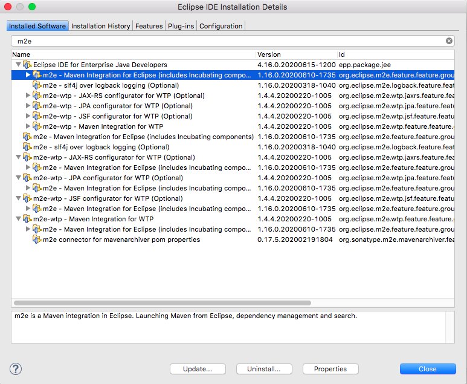

### 메이븐 프로젝트 추가

이클립스에 메이븐 플러그인이 설치되어 있다면 `pom`파일로 프로젝트를 추가할 수 있다. 이전 포스팅에서 생성했던 `pom`파일을 아래 그림과 같이 추가하자.

* 이클립스의 import기능을 사용한다.

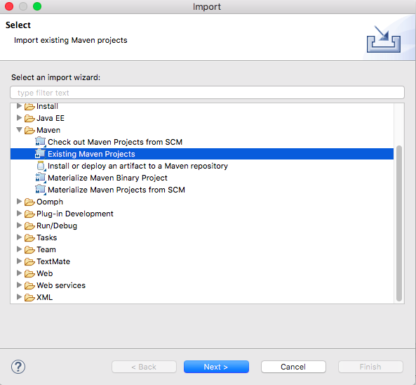

* `pom` 파일이 있는 폴더를 import 한다.

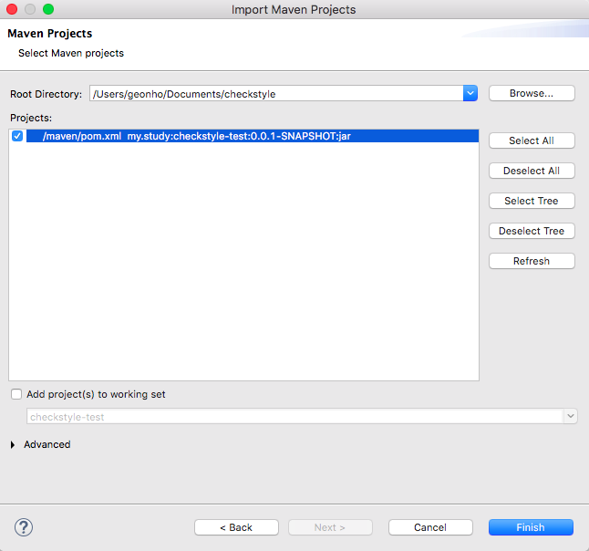

이클립스 메이븐 플러그인의 강력함은 `pom`파일을 추가한 것만으로도 알아서 이클립스프로젝트로 세팅을 한다. 

> 여기서 말하는 이클립스 프로젝트란 이클립스가 소스를 효율적으로 관리하기 위해 추가적으로 생성하는 다수의 파일을 포함하는 폴더그룹을 의미한다.

다음과 같이 이클립스 프로젝트로 추가된 것을 확인할 수 있다.

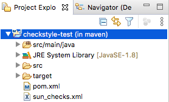

### 이클립스에서 메이븐 실행하기

이클립스에 `run`이라는 명령어가 있는데 이 명령어를 통해 메이븐플러그인을 수행할 수 있다. 

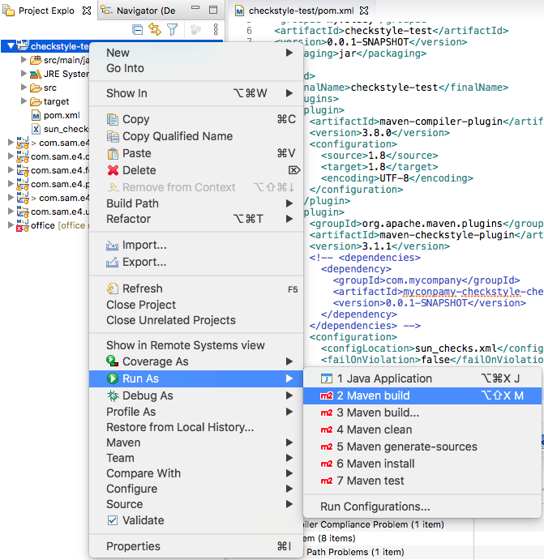

`run`명령어를 수행하면 아래 그림과 같이 메이븐 명령어를 입력하는 창이 나타난다. 터미널에서 체크스타일을 수행하기 위해 입력했던 명령어와 똑같은 명령어를 입력한다. 단,`mvn`명령어는 이클립스 메이븐 플러그인이 자동으로 입력해주기 때문에 그 이후부터의 명령어를 입력하면 된다.

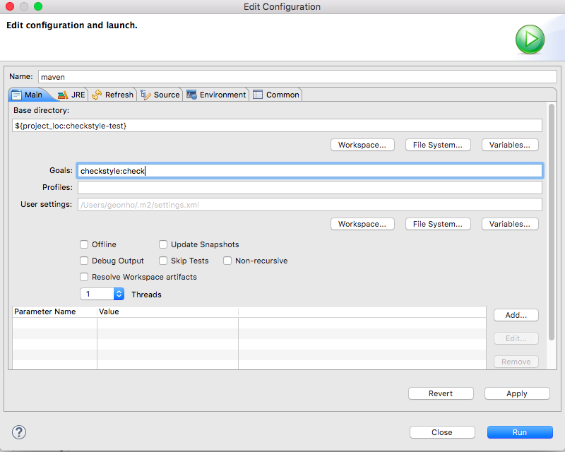

한번 입력한 명령어는 이클립스가 자동으로 기억하기 때문에 다음부터는 `run`명령어를 실행하는 것만으로도 체크스타일을 수행할 수 있다. `run`을 실행하면 이전에 터미널에서 직접 입력했던 것과 똑같이 메이븐이 실행되며 그 결과도 이클립스 콘솔창에 표시되는 것을 확인할 수 있다. 

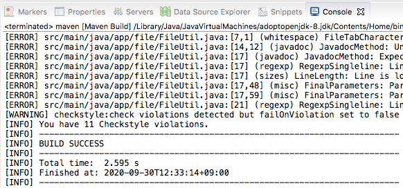

이클립스 `run`을 실행하는 단추키도 있으므로 이를 적절히 활용하면 매우 편하게 체크스타일을 수행할 수 있다.(윈도우에서는 `ALT + SHIFT + x, m`이다)

> 지금까지 했던 것은 이클립스 툴 측면에서는 단순히 메이븐을 실행만 한 것이다 이클립스가 체크스타일을 위해 별도의 역할을 한 것은 아무것도 없다. 모든 것은 메이븐이 수행했다는 것을 명심하자.


## 이클립스 체크스타일 플러그인

이클립스에서 체크스타일일 실행시키면서 문득 떠오르는 생각이있었다. 꼭 체크스타일을 실행하고 출력된 결과를 봐야만 소스의 검사가 되는 걸까?

이클립스와 같은 개발툴은 오류가 있는 소스나 불필요한 소스를 소스에디터에 waring/error로 즉시 표시해주기 때문에 굉장히 직관적이다. 이것은 개발자가 오류를 발생할 확률을 줄여주며 오류가 발생해도 즉시 해결 할 수 있도록 도와준다. 

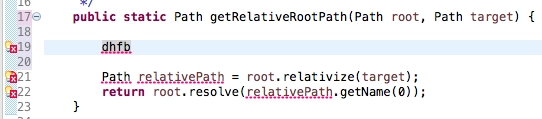

이와 같이 체크스타일도 규칙에 위반되는 사항을 즉시 소스에디터에 표시해주면 가독성이 훨씬 좋아지고 소스를 편집하는 시점에 즉시 위반사항을 알기 때문에 별도의 시간을 할애하여 체크스타일을 돌릴 필요도 없다. 그래서 찾아봤더니 역시 이런 기능이 있었다. 바로 이클립스 체크스타일 플러그인이다.(이클립스 메이븐 플러그인과 햇갈리지 말자)

### 이클립스 체크스타일 플러그인 소개

위에서 언급한대로 체크스타일을 이클립스에서 더욱 편하게 사용할 수 있도록 이클립스 플러그인 형태로 제공하는 곳이 있다. 자세한 정보는 [홈페이지](https://checkstyle.org/eclipse-cs/#!/) 를 방문하여 확인할 수 있다.

### 이클립스 체크스타일 플러그인 설치 

이클립스 체크스타일을 설치하는 방법이 좀 독특한데, 대부분의 이클립스 플러그인 설치는 이런 방식으로 진행되는 것 같다. 아래 그림과 같이 체크스타일 홈페이지에서 안내하는 설치 페이지를 방문하면 설치 버튼을 볼 수 있는 이 버튼을 자신의 이클립스로 드래그 앤 드랍한다. 

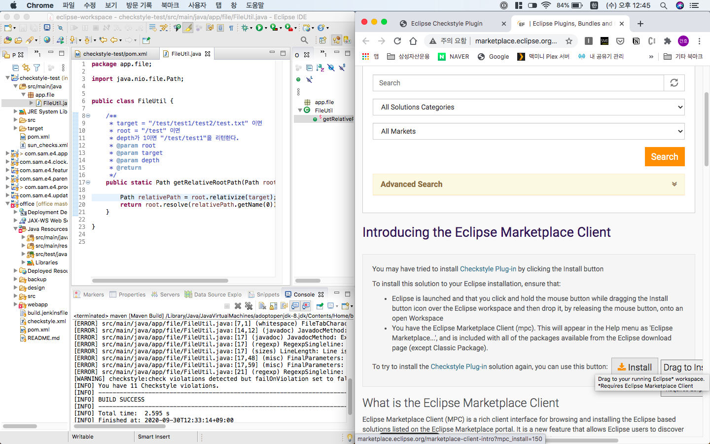

그러면, 자동으로 이클립스의 설치화면이 나타난다. 그 후 라이센스 동의 및 확인 과정을 거치면 손쉽게 설치를 할 수 있다. 설치 중간에 인증되지 않은 게시자 경고가 나타나는데 그냥 설치를 진행한다. 또 한, 설치가 완료되면 이클립스가 재시작된다.

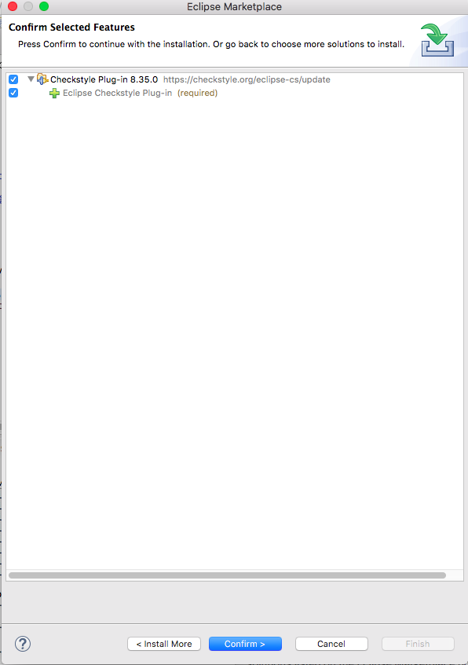

설치가 완료되면 아래 그림과 같이 체크스타일 전용 메뉴가 나타나는 것을 확인할 수 있다.

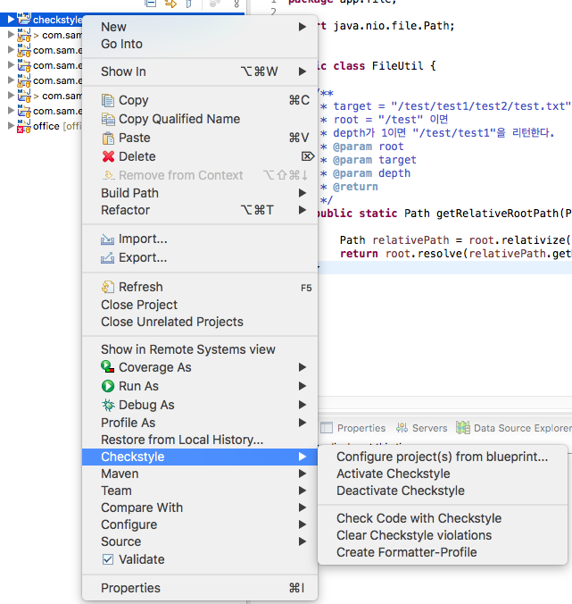

### 이클립스 체크스타일 플러그인 설정

이클립스 체크스타일 플러그인을 설치 한 후, preference에 가면 Checkstyle 메뉴가 새롭게 추가된 것을 확인할 수 있다. ▼

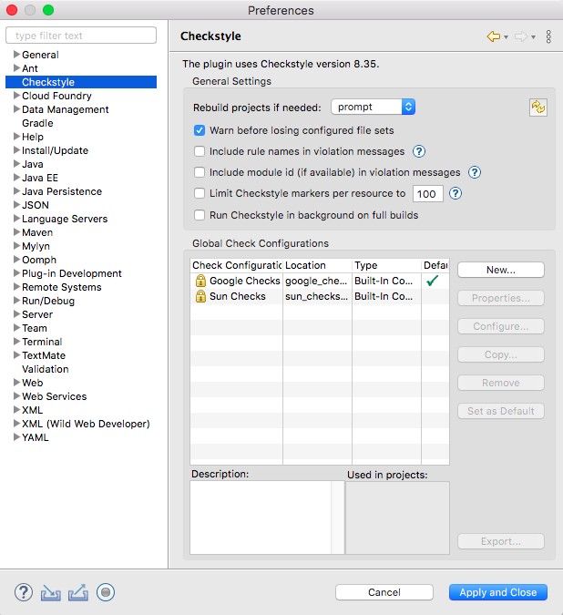

여러가지 설정이 있지만, 핵심 설정은 역시 체크스타일 설정 파일과 관련된 것이다. 위의 그림에서 `Global Check Configurations` 를 보면 구글체크가 기본 설정파일로 선택되어 있다. 그리고 그 아래 선 체크도 제공되고 있다. 또한, 오른쪽에 몇 가지 버튼이 있는 것으로 보아 우리가 직접 만든 설정파일을  사용할 수 있을 것으로 보인다.

우리가 추가한 프로젝트에 설정파일이 있기 때문에 기본으로 제공되는 2가지 설정파일(구글, 선)은 사용하지 않을 것이다. (물론 우리가 추가한 설정파일도 선에서 제공한 설정파일을 복사한 것이긴 하다)

오른쪽에 New버튼을 클릭해보자. 아래와 같이 설정파을 신규로 생성할 수 있는 화면이 나타난다. 

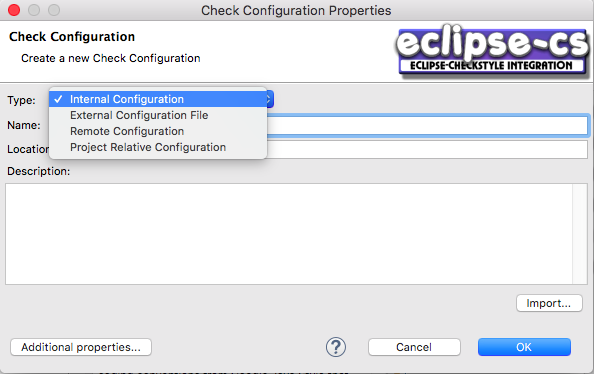

설정파일을 적용하는 방법은 4가지가 있다. 우리는 `Project Relative Configuration` 을 사용할 것이다. 이 방법은 설정파일을 특정 프로젝트의 경로에서 가져온다는 뜻이다. 프로젝트에 설정파일이 있으므로 이 방법을 사용하는 것이 제일 자연스러울 것이다. 아래와 같이 프로젝트에 있는 설정파일을 선택할 수 있다.

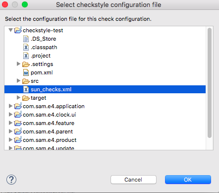

이 과정에서 한가지 예상하지 못한 문제가 발생하였는데 다음과 같이 설정파일에 있는 특정 프로퍼티를 읽을 수 없다는 오류이다. 

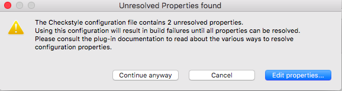

선에서 제공했던 설정파일을 자세히 살펴보니 아래와 같이 이클립스 체크스타일 플러그인이 알 수 없는 프로퍼티가 있는 것을 발견하였다. (`${}` 안에 있는 값이다) 

```xml
<module name="SuppressionFilter">
  <property name="file" value="${org.checkstyle.sun.suppressionfilter.config}"
            default="checkstyle-suppressions.xml" />
  <property name="optional" value="true"/>
</module>

<module name="SuppressionXpathFilter">
  <property name="file" value="${org.checkstyle.sun.suppressionxpathfilter.config}"
            default="checkstyle-xpath-suppressions.xml" />
  <property name="optional" value="true"/>
</module>
```

SuppressingFilter는 특정 config파일을 읽어 수행하는 기능이 있는데 선에서 제공하는 설정은 프로퍼티를 읽어서 수행하는 것으로 작성되어 있다. 우리가 진행하려는 것과 상관없는 것이니 주석으로 막고 진행하도록 하자. 

설정 파일이 잘 적용 되면 다음과 같이 내가 입력한 체크설정이 화면에 나타나게 된다. `Set as Default` 버튼을 이용하여 내가 추가한 설정을 기본 설정이 되도록 할 수 있다.

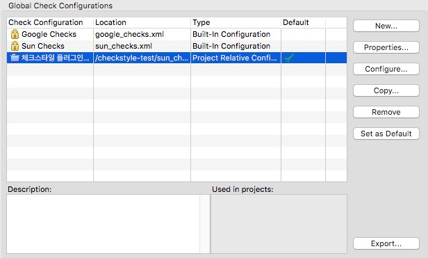

이 상태에서 우축에 있는 `Configure...` 버튼을 눌러보자. 새로운 화면이 나타나게 되는데 이 화면이 이클립스 체크스타일 플러그인의 가장 매력적인 기능이다. 체크스타일을 설정을 수정하려면 xml파일을 직접 수정했지만 이제는 그러지 않아도 된다. 아래 보이는 화면에서 모든 설정을 할 수 있고 설정을 변경하면 자동으로 xml파일의 내용도 바뀐다.

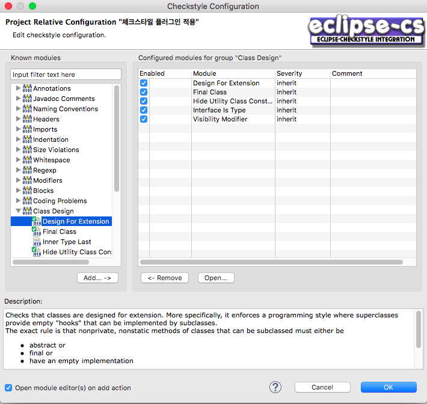

위의 화면을 보면 알수 있듯이 각 체크 모듈마다 하단에 설명이 있기 때문에(비록 영어이지만) 일일이 홈페이지를 방문하지 않아도 되며 내가 적용중인 체크와 적용하지 않은 체크도 표시해주고 있다. 

### 이클립스 체크스타일 플러그인 실행

설정 파일을 등록하였으니 체크 스타일을 실제로 적용 보도록 하자. 프로젝트 익스플로러에 가서 각 프로젝트마다 체크스타일을 활성화 시킬 수 있다. 

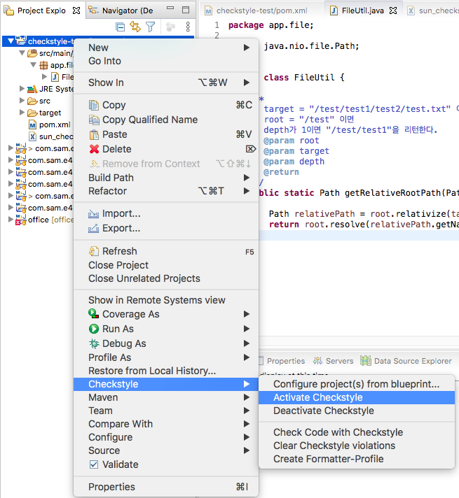

활성화를 하면 당황스러운 화면을 보게 된다. 활성화 전까지 전혀 문제가 없던 소스가 갑자기 에러 투성이로 변한다. 모두 체크스타일이 검사해서 지적하는 내용들이다. 실제 컴파일에 문제가 없는 소스인데 문제가 있는 것처럼 보이니 오류 메세지를 경고 메세지로 변경도 가능하다.

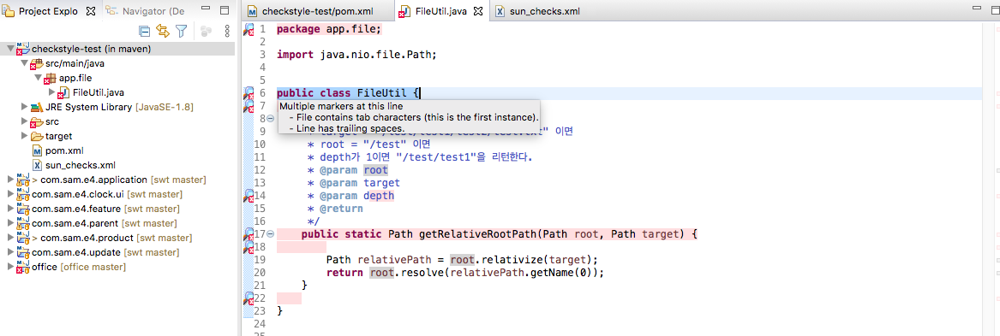

### 소스에디터에서 확인하기

자 이제 체크스타일에서 지적한 것을 하나 하나 해결해보자. 소스를 수정할 때마다 체크스타일 에러메시지가 하나씩 바로 사라지는 것을 확인할 수 있다. 정말 직관적이고 편하며 개발과 동시에 소스코드의 품질도 향상 시킬 수 있는 거의 체크스타일의 끝판왕인 플러그인이다. 

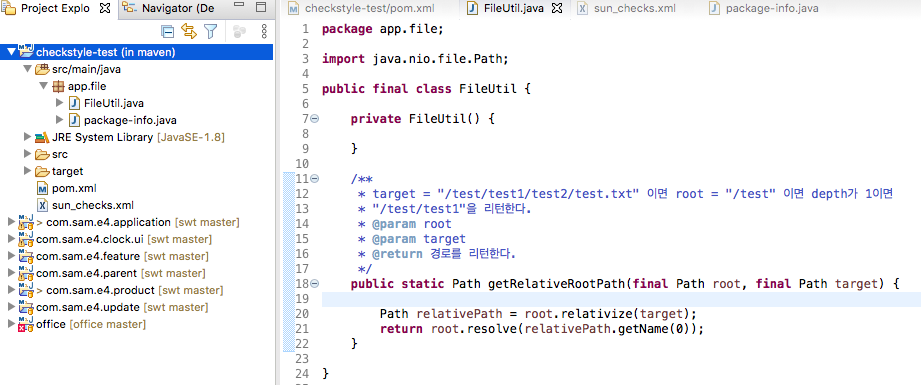

> 포스티에서는 체크스타일이 지적한, 정확히는 선에서 가이드하는 설정파일이 지적한 것에 맞춰서 코드를 수정하였지만, 꼭 가이드를 지킬 필요가 없다. 설정파일을 수정하여 자신이 허용할 수 있는 범위의 코드 규칙만 설정하고 나머지는 설정하지 않는 방법으로 적절히 타협하는 것이 필요하다.

## 마무리

이번 포스팅은 이클립스를 사용하여 체크스타일을 적용하는 방법을 알아보았다. 이클립스 체크스타일 플러그인을 사용하면 엔터프라이즈급 프로젝트에서도 충분히 코딩 표준을 잘 지킬 수 있을 것으로 기대된다.

하지만, 아직 완벽한 것은 아니다. 왜냐하면 프로젝트별로 특화된 코딩 규칙이 있기 때문이다. 이를 위해 다음 포스팅에서는 커스텀 체크를 적용하는 방법을 알아보도록 하겠다.

## 출처

https://checkstyle.org/eclipse-cs/#!/