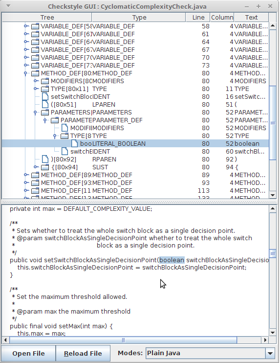

## 체크스타일의 한계

이전 포스트까지 체크스타일에서 제공하는 기능과 이것을 쉽게 사용할 수 있는 방법을 알아보았다. 특히 체크스타일은 설정파일을 이용하여 다양한 관점으로 자신의 소스를 검사할 수 있는 기능을 제공하였다. 

하지만, 체크스타일이 제공하는 설정파일은 우리가 원하고자 하는 모든 것을 검사할수 없다. 이 시리즈의 첫번째 포스팅에서 언급하였 듯이 소스코드의 클래스, 변수 등의 명명규칙이나 주석 표준 등은 프로젝트 별로 다르기 때문에 기본 설정으로 이렇게 다양한  규칙을 적용할 수 없기 때문이다.

## 커스텀 체크(custom check)

이런 한계를 극복하기 위해, 체크스타일은 사용자가 직접 체크모듈을 만들수 있는 기능을 제공하고 있다. 다음 [링크](https://checkstyle.sourceforge.io/extending.html)를 방문하면 커스터마이징 할 수 있는 방법을 가이드 하고 있다. 필자도 이 가이드를 참조하여 커스텀 체크를 작성하였고 프로젝트에 적용하여 활용하고 있다.

홈페이지에서는 우리가 다음의 것들을 직접 작성할 수 있다고 설명한다. 

* Checks
* Javadoc Checks
* filters
* file filters
* listeners

이 포스팅에서는 체크모듈을 작성(Writing Checks)것에 대해서만 다루도록 하겠다. 왜냐하면 필자도 이것밖에 할 줄 모르고 체크모듈을 작성할 줄 안다면 다른 것들도 거의 비슷하다고 판단하기 때문이다.

## 나만의 체크 만들기(Writing Checks)

혹시, Checks가 무엇인지 왜 만들어야 하는지 모르겠다면 다음 설정파일을 살펴보도록 하자. 설정파일중 아래와 같은 항목이 보일 것이다.

```xml
<!-- Checks for class design -->
<module name="DesignForExtension"/>
<module name="FinalClass"/>
<module name="HideUtilityClassConstructor"/>
<module name="InterfaceIsType"/>
<module name="VisibilityModifier"/>

```

위의 예시에서 모듈(modul) 태그안에 있는 것을 체크(Check)라고 부른다. 커스텀 체크를 만든다는 것은 이 설정에 추가할 수 있는 모듈을 직접 만든다는 것이다.

## 체크스타일 동작 원리 이해하기

커스텀 체크를 작성하기 전에 체크스타일의 동작원리를 이해하는 것이 중요하다. 

### 모듈 트리

홈페이지의 내용을 보면 체크스타일은 모듈의 조합으로 이루어져있고 이 모듈은 트리형태로 구성된다. 루트 모듈이 (이 모듈은 FileSetCheck 인터페이스를 구현했다)은 TreeWalker를 호출하는데 이 트리워커는 설정파일에서도 확인할 수 있다. 

```xml
... 중략 ...
<module name="TreeWalker">

    <module name="InvalidJavadocPosition"/>
    <module name="JavadocMethod"/>
... 중략 ...
```

트리워커안에 다수의 서브모듈이 들어있다. 다수의 서브모듈은 AbstractCheck를 상속한 클래스들이다. 이것으로 보아, AbstractCheck를 상속한 어떤 클래스를 만들고 이 클래스를 설정파일의 트리워커안에 모듈로 추가한다면 커스텀 체크를 적용할 수 있을 것으로 보인다. 

### 소스 파싱

체크스타일의 핵심 기능중의 하나는 자바소스를 읽어 구조화하는 것이다. 소스 파싱은 체크스타일이 알아서 잘 할 것이니 우리가 신경쓰지 않아도 되지만 구조화된 내용은 잘 이해해야 한다. 왜냐하면 커스텀 체크를 작성할 때 이 구조화된 내용을 지도 삼아 소스의 여기저기를 살펴봐야하기 때문이다. 

> 궁극적인 목적은 소스를 보고 그 소스의 어떤 부분이 우리가 정한 규칙에 어긋나느냐를 판단하는 것이다. 이 과정에서 소스의 특정 부분을 찾는 것이 커스텀 체크모듈을 작성하는 부분에서 많은 부분을 차지한다.

### 자바트리구조체(Java Tree Structure)

홈페이지에서는 위에서 언급한 구조화된 내용을 자바트리구조체라고 하며, 체크스타일이 소스를 파싱하여 생성하는 자바트리구조체를 이해할 필요가 있다고 한다. 예를 들어, 아래와 같은 자바 소스는 

```java
/**
 * My <b>class</b>.
 * @see AbstractClass
 */
public class MyClass {

}
```

 체크스타일의 소스파싱 작업을 거친 후 아래와 같이 자바트리구조체로 설명할 수 있다.

```
CLASS_DEF -> CLASS_DEF [5:0]
|--MODIFIERS -> MODIFIERS [5:0]
|   `--LITERAL_PUBLIC -> public [5:0]
|--LITERAL_CLASS -> class [5:7]
|--IDENT -> MyClass [5:13]
`--OBJBLOCK -> OBJBLOCK [5:21]
    |--LCURLY -> { [5:21]
    `--RCURLY -> } [7:0]
```

보면 알 수 있듯이 매우 단순한 자바소스도 복잡한 트리구조로 되어 있다. 또한, 이것을 좀 더 비주얼적으로 볼 수 있는 GUI 툴을 제공한다. 



커스텀 체크를 작성한다면 이 툴은 필수다. 필자는 커스텀 체크를 작성하기 전에 대상이 되는 소스로 이 툴을 이용하여 트리구조를 확인했다. 트리 구조를 확인하면 대략적인 로직의 설계가 가능하다. 여러분도 커스텀 체크를 작성한다면 꼭 이 툴을 활용할 것을 추천한다.

친절하게도, 이 툴은 이클립스 플러그인으로도 제공하기 때문에 이클립스를 사용한다면 다음 [링크](https://github.com/sevntu-checkstyle/checkstyle-ast-eclipse-viewer) 에서 받아 설치하도록 하자. 

### visitor patter(비지터 패턴)

### 토큰

## 샘플 커스터 체크 만들기

기능 

1. 패키지 명칭은 항상 com.my로 시작한다. 
2. 클래스 명칭은 패키지명칭의 com.my 이후 2글자와 동일해야 한다. 
   예) com.my.at.sy  패키지이면 클래스는 AtSy로 시작해야 한다.

패키지 이름 체크 모듈

클래스 이름 체크 모듈

## 메이븐 빌드하기

메이븐 빌드(install)를 하면 내가 만든 jar가 메이븐 로컬리포에 저장된다. 

## 메이븐 환경설정에 추가


## 메이븐 실행 및 확인


## [목표] 체크스타일 이클립스 플러그인에 적용

이클립스 플러그인에서는 내가 작성한 체크스타일을 적용할 수 없다. 


## 마무리

다음 포스팅 : 소나큐브에 적용하기


## 참고

https://checkstyle.sourceforge.io/extending.html