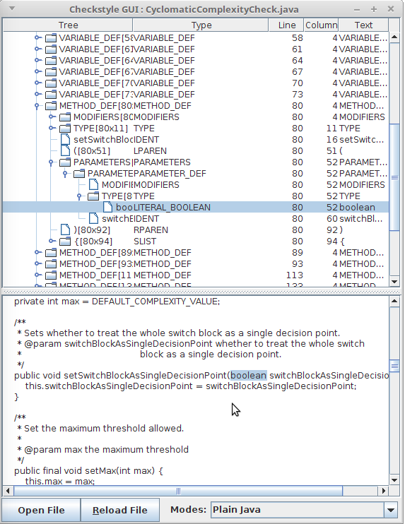
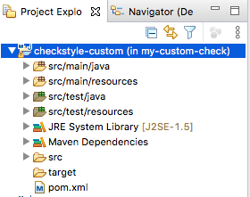
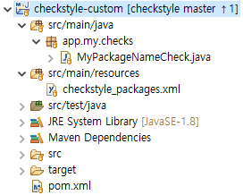
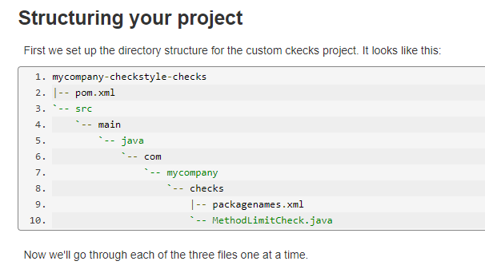
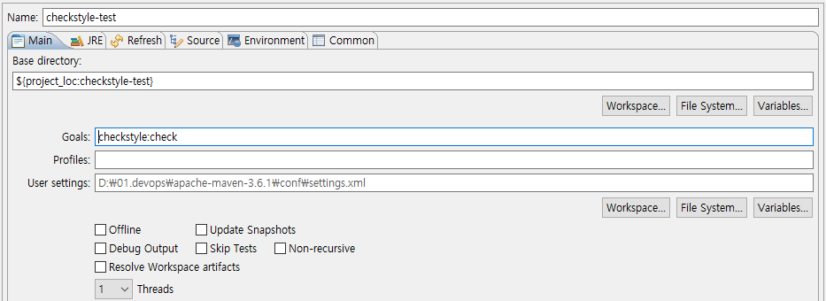
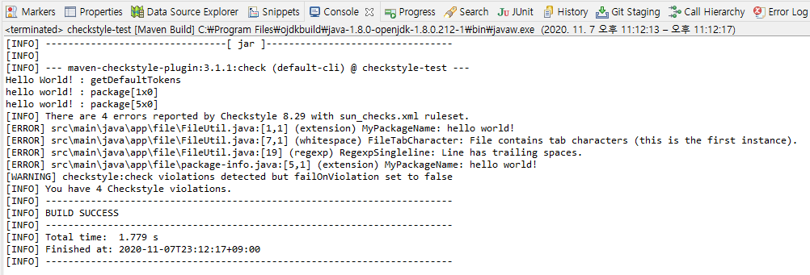
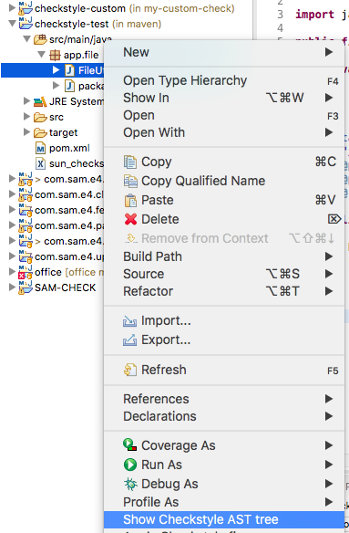
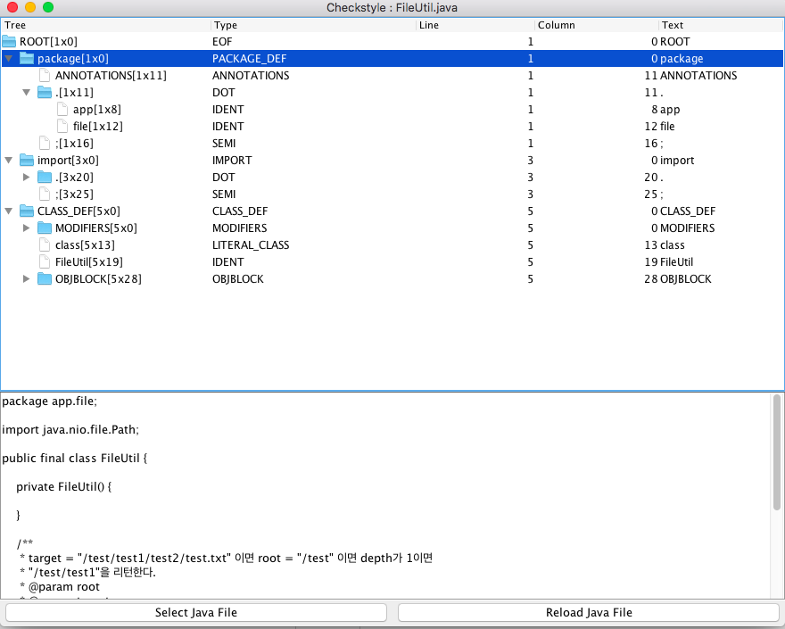
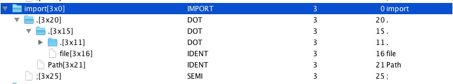
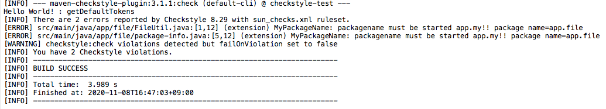

## 체크스타일의 한계

이전 포스트까지 체크스타일에서 제공하는 기능과 이것을 쉽게 사용할 수 있는 방법을 알아보았다. 특히 체크스타일은 설정파일을 이용하여 다양한 관점으로 자신의 소스를 검사할 수 있는 기능을 제공하였다. 

하지만, 체크스타일이 제공하는 설정파일은 우리가 원하고자 하는 모든 것을 검사할수 없다. 이 시리즈의 첫번째 포스팅에서 언급하였 듯이 소스코드의 클래스, 변수 등의 명명규칙이나 주석 표준 등은 프로젝트 별로 다르기 때문에 기본 설정으로 이렇게 다양한  규칙을 적용할 수 없기 때문이다.

## 커스텀 체크(custom check)

이런 한계를 극복하기 위해, 체크스타일은 사용자가 직접 체크모듈을 만들수 있는 기능을 제공하고 있다. 다음 [링크](https://checkstyle.sourceforge.io/extending.html)를 방문하면 커스터마이징 할 수 있는 방법을 가이드 하고 있다. 필자도 이 가이드를 참조하여 커스텀 체크를 작성하였고 프로젝트에 적용하여 활용하고 있다.

홈페이지에서는 우리가 다음의 것들을 직접 작성할 수 있다고 설명한다. 

* Checks
* Javadoc Checks
* filters
* file filters
* listeners

이 포스팅에서는 체크모듈을 작성(Writing Checks)것에 대해서만 다루도록 하겠다. 왜냐하면 필자도 이것밖에 할 줄 모르고 체크모듈을 작성할 줄 안다면 다른 것들도 거의 비슷하다고 판단하기 때문이다.

## 나만의 체크 만들기(Writing Checks)

혹시, Checks가 무엇인지 왜 만들어야 하는지 모르겠다면 다음 설정파일을 살펴보도록 하자. 설정파일중 아래와 같은 항목이 보일 것이다.

```xml
<!-- Checks for class design -->
<module name="DesignForExtension"/>
<module name="FinalClass"/>
<module name="HideUtilityClassConstructor"/>
<module name="InterfaceIsType"/>
<module name="VisibilityModifier"/>

```

위의 예시에서 모듈(module) 태그안에 있는 것을 체크(Check)라고 부른다. 커스텀 체크를 만든다는 것은 이 설정에 추가할 수 있는 모듈을 직접 만든다는 것이다.

## 체크스타일 동작 원리 이해하기

커스텀 체크를 작성하기 전에 체크스타일의 동작원리를 이해하는 것이 중요하다. 

### 모듈 트리

홈페이지의 내용을 보면 체크스타일은 모듈의 조합으로 이루어져있고 이 모듈은 트리형태로 구성된다. 루트 모듈이 (이 모듈은 FileSetCheck 인터페이스를 구현했다)은 TreeWalker를 호출하는데 이 트리워커는 설정파일에서도 확인할 수 있다. 

```xml
... 중략 ...
<module name="TreeWalker">

    <module name="InvalidJavadocPosition"/>
    <module name="JavadocMethod"/>
... 중략 ...
```

트리워커안에 다수의 서브모듈이 들어있다. 다수의 서브모듈은 AbstractCheck를 상속한 클래스들이다. 이것으로 보아, AbstractCheck를 상속한 특정 클래스를 만들고 이 클래스를 설정파일의 트리워커(TreeWalker)안에 모듈태그를 사용하여 추가한다면 커스텀 체크를 적용할 수 있을 것으로 보인다. 

### 소스 파싱

체크스타일의 핵심 기능중의 하나는 자바소스를 읽어 구조화하는 것이다. 소스 파싱은 체크스타일이 알아서 잘 할 것이니 우리가 신경쓰지 않아도 되지만 체크스타일이 파싱하여 구조화한 내용은 잘 이해해야 한다. 왜냐하면 커스텀 체크를 작성할 때 이 구조화된 내용을 알아야 내가 찾고자 하는 특정 내용을 찾을 수 있기 때문이다. 예를 들어, 클래스명이 My로 시작하는지 체크하고자 할 때 우리는 구조화 된 내용에서 클래스명에 대한 내용을 찾을 수 있어야 한다.

> 우리의 궁극적인 목적은 소스를 검색하며 소스의 특정 부분이 우리가 정한 규칙에 부합하는지를 판단하는 것이다. 이 과정에서 소스의 특정 부분을 찾는 것이 커스텀 체크모듈을 작성하는 부분에서 많은 부분을 차지한다.

### 자바트리구조체(Java Tree Structure)

홈페이지에서는 위에서 언급한 구조화된 내용을 자바트리구조체라고 하며, 체크스타일이 소스를 파싱하여 생성하는 자바트리구조체를 이해할 필요가 있다고 한다. 예를 들어, 아래와 같은 자바 소스는 

```java
/**
 * My <b>class</b>.
 * @see AbstractClass
 */
public class MyClass {

}
```

 체크스타일의 소스파싱 작업을 거친 후 아래와 같이 자바트리구조체로 설명할 수 있다.

```
CLASS_DEF -> CLASS_DEF [5:0]
|--MODIFIERS -> MODIFIERS [5:0]
|   `--LITERAL_PUBLIC -> public [5:0]
|--LITERAL_CLASS -> class [5:7]
|--IDENT -> MyClass [5:13]
`--OBJBLOCK -> OBJBLOCK [5:21]
    |--LCURLY -> { [5:21]
    `--RCURLY -> } [7:0]
```

보면 알 수 있듯이 매우 단순한 자바소스도 복잡한 트리구조로 되어 있다. 또한, 이것을 좀 더 비주얼적으로 볼 수 있는 GUI 툴을 제공한다. 이 툴은 자바트리구조체를 아래와 같이 화면으로 표현하여 훨씬 편하게 내용을 확인할 수 있다. ▼



커스텀 체크를 작성한다면 이 툴은 꼭 사용해야 한다. 체크스타일이 생성하는 트리구조를 이해해야 커스텀 체크에 필요한 로직을 정확히 작성할 수 있기 때문이다. 트리 구조를 확인하면 대략적인 로직의 설계가 가능하다. 필자는 커스텀 체크를 작성하기 전에 대상이 되는 소스로 이 툴을 이용하여 트리구조를 확인하고 로직을 전개하였다.

친절하게도, 이 툴은 이클립스 플러그인으로도 제공하기 때문에 이클립스를 사용한다면 다음 [링크](https://github.com/sevntu-checkstyle/checkstyle-ast-eclipse-viewer) 에서 받아 설치하도록 하자. 

### 비지터 패턴 (visitor pattern)

간단하게 말해서 체크스타일이 동작하는 것은 디자인 패턴중 비지터 패턴을 이용하여 동작한다는 내용이다. 비지터 패턴이 궁금한 사람은 한 번 살펴보길 추천한다.

사실 비지터 패턴을 몰라도 다음 원리만 이해하고 있으면 상관없다. 아래 소스를 보자.

```java
public class MethodLimitCheck extends AbstractCheck
{
  private static final int DEFAULT_MAX = 30;
  private int max = DEFAULT_MAX;

  @Override
  public int[] getDefaultTokens()
  {
    return new int[]{TokenTypes.CLASS_DEF, TokenTypes.INTERFACE_DEF};
  }

  @Override
  public void visitToken(DetailAST ast)
  {
    // find the OBJBLOCK node below the CLASS_DEF/INTERFACE_DEF
    DetailAST objBlock = ast.findFirstToken(TokenTypes.OBJBLOCK);

    // count the number of direct children of the OBJBLOCK
    // that are METHOD_DEFS
    int methodDefs = objBlock.getChildCount(TokenTypes.METHOD_DEF);

    // report violation if limit is reached
    if (methodDefs > this.max) {
      String message = "too many methods, only " + this.max + " are allowed";
      log(ast.getLineNo(), message);
    }
  }
}
```

위의 소스는 우리가 커스텀 체크 스타일을 만들때 구현하는 핵심 소스이다. 클래스명 `MethodLimitCheck` 가 하나의 체크 모듈에 대응한다.

`AbstractCheck` 를 상속 했기 때문에 필수로 구현해야 하는 매소드가 몇 개 있다. `getDefaultTokens` 매소드를 통하여 이 모듈이 해당 토큰을 방문할지 안할지를 결정한다. `visitToken` 매소드는 해당 토큰에서 실제 체크해야 하는 로직이 들어가는 부분이다. 

중요한 것은 **체크스타일이 알아서 위의 매소드를 호출해 준다는 것**이다.

### 토큰

바로 앞에서 토큰이라는 단어를 언급하였다. 그럼 토큰이 무엇일까? 아주 간단히 말하면 위에서 언급한 자바트리구조체에서 하나의 요소이다. 트리구조이기 때문에 하나의 토큰은 하나의 노드라고 표현할수 있다. 트리의 노드가 자식노드를 가지는 것 처럼 토큰도 자식 토큰을 가질 수 있다. 체크스타일이 자바소스를 파싱하여 토큰으로 이루어진 트리구조를 만들고 비지터 패턴을 이용하여 각 토큰마다 체크스타일 모듈이 호출될 수 있도록 한다. 

### 기본 지식 마무리

지금까지 체크스타일의 기본지식을 알아보았다. 약간 어려운 내용이기도 하고 나의 설명이 부족하여 이해하는데 많은 어려움이 있을 것으로 보인다. 이제부터는 특정 기능을 수행하는 커스텀 체크를 만들어가며 체크스타일을 이해하도록 하자.

## 샘플 커스텀 체크 만들기

### 기능 명세

다음 기능을 수행하는 커스터 체크 모듈을 만들어보자. 

1. 패키지 명칭을 검사하여 app.my로 시작하지 않으면 위반이다.
2. 패지지 명칭을 검사하여 app.my 이후 최소 하나의 패키지명이 있어야 한다. 예) app.my.file
3. 클래스 명칭은 패키지명칭의 app.my 이후 첫 패키지 명과 동일해야 한다. 예) com.my.file 패키지이면 클래스는 File로 시작해야 한다.

위의 기능을 수행하기 위해 필요한 모듈을 2개로 만들기로 하자. 

1. 패키지 이름 체크 모듈 : MyPackageNameCheck
2. 클래스 이름 체크 모듈 : MyClassNameCheck

### 이클립스 프로젝트 생성

본 포스팅에서는 이클립스를 이용하여 체크스타일을 개발하겠다. 그리고 빌드를 위해 메이븐을 활용하겠다. 메이븐을 이용하면 편하게 커스텀 체크를 개발 할 수 있다. 다음과 같이 새로운 메이븐 프로젝트를 생성한다. 

 

pom파일은 다음과 같다. 

```xml
<project xmlns="http://maven.apache.org/POM/4.0.0"
  xmlns:xsi="http://www.w3.org/2001/XMLSchema-instance"
  xsi:schemaLocation="http://maven.apache.org/POM/4.0.0 https://maven.apache.org/xsd/maven-4.0.0.xsd">
  <modelVersion>4.0.0</modelVersion>
  <groupId>app.my</groupId>
  <artifactId>checkstyle-custom</artifactId>
  <version>0.0.1-SNAPSHOT</version>
  <name>my custom check</name>
  
  <properties>
    <project.build.sourceEncoding>US-ASCII</project.build.sourceEncoding>
  </properties>  
  
  <build>
    <plugins>
      <plugin>
        <artifactId>maven-compiler-plugin</artifactId>
        <version>3.8.0</version>
        <configuration>
          <source>1.8</source>
          <target>1.8</target>
          <encoding>US-ASCII</encoding>
        </configuration>
      </plugin>
    </plugins>
  </build>
  <dependencies>
    <dependency>
      <groupId>com.puppycrawl.tools</groupId>
      <artifactId>checkstyle</artifactId>
      <version>8.36.2</version>
    </dependency>
  </dependencies>
</project>
```

별다른 것은 없고 의존성에 체크스타일 라이브러리가 추가되었다. 이렇게 해야 `AbstractCheck`를 상속할 수 있다. 인코딩 설정을 US-ASCII로 하였는데 이것은 다음의 제약사항 부분에서 설명하도록 하겠다.

### 체크 모듈 작성하기 - 1

모든 프로그램의 기본은 hollo world! 를 콘솔창에 출력하는 것이다. 우리도 애초의 목적 달성하기 전에 빠르게 hello world를 찍어보면서 커스텀 체크 모듈이 정말 동작하는지 확인하도록 하자.

이를 위해 2개 파일을 생성한다.(pom 파일 제외)

* app.my.checks.MyPackageNameCheck.java
* checkstyle_packages.xml

이클립스 프로젝트 익스플로러에서 보면 다음과 같다.



#### MyPackageNameCheck.java

MyPackageNameCheck.java 파일의 소스는 다음과 같다. 

```java
public class MyPackageNameCheck extends AbstractCheck {

    @Override
    public int[] getDefaultTokens() {
        System.out.println("Hello World! : getDefaultTokens");
        return new int[] { TokenTypes.PACKAGE_DEF };  
    }

    @Override
    public int[] getAcceptableTokens() {
        System.out.println("Hello World! : getAcceptableTokens");
        return null;
    }

    @Override
    public int[] getRequiredTokens() {
        System.out.println("Hello World! : getRequiredTokens");
        return null;  
    }

    @Override
    public void visitToken(DetailAST ast) {
		log(ast, "hello world!");
		System.out.println("hello world! : " + ast);
    }
}
```

가장 중요한 부분이 `AbstractCheck` 를 상속하였고 최소 4개의 매서드를 오버라이드 해야 한다는 것이다. 

#### checkstyle_packages.xml

이 파일은 메이븐 체크 스타일 플러그인을 사용할 때 필요한 파일이다. 이 파일은 내가 작성한 체크 스타일 모듈이 어디에 있는 메이븐 체크 스타일 플러그인에게 알려주는 역할을 한다. 즉, 나의 체크스타일 설정파일은 설정에 집중하는 것이고 라이브러리 의존성은 메이븐 설정을 이용하여 서로의 역할에 충실하도록 하는 것이다. 

파일의 위치가 중요한데, 필자가 처음 커스터 체크를 작성할 때 메이븐 체크 스타일 플러그인 홈페이지의 가이드를 참조하였는데 그곳에서는 packagenames.xml을 작성하여 내가 작성한 MyPackageNameCheck.java 파일과 같은 폴더에 위치하도록 가이드하였다. ([링크](https://maven.apache.org/plugins/maven-checkstyle-plugin/examples/custom-developed-checkstyle.html)를 확인해보자)

아래 그림은 홈페이지의 가이드를 캡쳐한 것이다. 이와 같은 구조로 작성하면 안된다. 아무리 해도 안된다. 



한참을 찾아보니 체크스타일 홈페이지에 다음과 같은 내용이 있었다. ([링크](https://checkstyle.sourceforge.io/config.html#Packages) 확인)

> To specify other packages to apply, create a *package names XML document* in a file named `checkstyle_packages.xml`, and provide that file in the root of the .jar containing your custom checks.
>
> [해석] 또 다른 패키지를 적용하기 위해서는, 파일명 `checkstyle_packages.xml` 을 작성하여 너가 작성한 커스텀 체크 모듈을 가지고 있는 jar 파일의 root 패스에 위치하도록 해야 한다.

필자와 같은 과오를 범하지 말고 `checkstyle_packages.xml`파일을 작성하여 src/main/resources 폴더에 두자. 이렇게 하면 메이븐 빌드시 알아서 jar파일의 root 패스에 위치하게 된다.

이 파일에 작성해야 되는 내용은 다음과 같다. 

```xml
<?xml version="1.0" encoding="UTF-8"?> 
<!DOCTYPE checkstyle-packages PUBLIC
  "-//Checkstyle//DTD Package Names Configuration 1.0//EN"
  "https://checkstyle.org/dtds/packages_1_0.dtd">
  
<checkstyle-packages>
  <package name="app.my.checks" />
</checkstyle-packages>
```

내가 작성한 커스텀 체크 모듈의 jar파일에 `app.my.checks` 패키지에 체크 모듈이 있다는 것을 체크 스타일에게 알려주는 것이다.

### 체크 모듈 빌드 및 배포하기

Hello world! 출력을 위한 체크 모듈은 작성되었다. 우리가 만들 모듈을 jar파일로 만들기 위해 메이븐을 이용할 것이다. 메이븐 명령어는 다음과 같다. 

```
mvn clean package install
```

메이븐 실행은 이클립스 또는 윈도우 커맨드 창에서 할 수 있다. install을 하는 이유는 나의 메이븐 로컬 리포지토리에 생성한 jar 파일을 등록하기 위해서다. 추가적인 사항은 메이븐과 관련된 지식이 필요하니 여기서는 다루지 않겠다. 

### 인코딩 문제(제약사항)

커스텀 체크 스타일 라이브러리는 UTF-8을 지원하지 않는다고 한다. (이 시대에 아직도 ~~ ) 이 외에도 몇 가지 제약 사항이 존재 하니 다음 [링크](https://checkstyle.sourceforge.io/writingchecks.html#Limitations)에서 확인하도록 하자. 만약 자신의 이클립스 프로젝트의 기본 인코딩이 UTF-8이라면 US-ASCII로 설정을 변경해야 한다. 위의 maven pom에서 encoding 설정이 US-ASCII들어 있는 이유도 이 때문이다. 다음 그림은 이클립스에서 인코딩 설정을 변경하는 화면이다.

## 커스텀 체크 실행

### 메이븐 설정

이제 체크 스타일의 검사 대상이 되는 프로젝트로 이동하자. 지난 포스트의 메이븐 플러그인을 이용한 체크스타일 실행에서 사용했던 그 프로젝트이다. 여기서 해야 할일은 다음 2가지다. 

* 메이븐 체크스타일 플러그인에 커스텀 체크 모듈 의존성 추가

* 체크스타일 설정파일에 내가 생성한 체크 추가

이 프로젝트의 pom파일에 아래와 같이 디펜던시를 추가한다. 

```xml
<project xmlns="http://maven.apache.org/POM/4.0.0"
  xmlns:xsi="http://www.w3.org/2001/XMLSchema-instance"
  xsi:schemaLocation="http://maven.apache.org/POM/4.0.0 http://maven.apache.org/xsd/maven-4.0.0.xsd">
  <modelVersion>4.0.0</modelVersion>
  <groupId>my.study</groupId>
  <artifactId>checkstyle-test</artifactId>
  <version>0.0.1-SNAPSHOT</version>
  <packaging>jar</packaging>

  <build>
    <finalName>checkstyle-test</finalName>
    <plugins>
      <plugin>
        <artifactId>maven-compiler-plugin</artifactId>
        <version>3.8.0</version>
        <configuration>
          <source>1.8</source>
          <target>1.8</target>
          <encoding>UTF-8</encoding>
        </configuration>
      </plugin>
      <plugin>
        <groupId>org.apache.maven.plugins</groupId>
        <artifactId>maven-checkstyle-plugin</artifactId>
        <version>3.1.1</version>
        <!-- 커스텀 체크 의존성 추가 -->
        <dependencies>
          <dependency>
			<groupId>app.my</groupId>
			<artifactId>checkstyle-custom</artifactId>
            <version>0.0.1-SNAPSHOT</version>
          </dependency>
        </dependencies>
        <configuration>
          <configLocation>sun_checks.xml</configLocation>
          <failOnViolation>false</failOnViolation>
        </configuration>
      </plugin>
    </plugins>
  </build>
</project>
```

이전 단계에서 메이븐 install 명령어를 통하여 로컬 리포지토리에 커스텀 체크 jar를 등록했기 때문에 메이븐이 알아서 이 jar 파일을 불러온다. 다른 pc에서 install 없이 수행한다면 메이븐이 해당 jar를 찾지 못할 것이다.  

다음으로 해야 할일은 `sun_checks.xml` 에 내가 만든 체크 모듈을 추가하는 것이다.  다음과 같이 추가하자. 

```xml
<?xml version="1.0"?>
<!DOCTYPE module PUBLIC
          "-//Checkstyle//DTD Checkstyle Configuration 1.3//EN"
          "https://checkstyle.org/dtds/configuration_1_3.dtd">
<module name="Checker">
  <property name="severity" value="error"/>
  <property name="fileExtensions" value="java, properties, xml"/>
  <module name="BeforeExecutionExclusionFileFilter">
    <property name="fileNamePattern" value="module\-info\.java$"/>
  </module>
  ... 생략 ...
  <module name="TreeWalker">
    ... 생략 ...
    <module name="UpperEll"/>    
    <module name="MyPackageName" />
  </module>
</module>
```

위의 파일과 같이 MyPackageName 모듈을 추가하였다. 내가 작성한 클래스명은 `MyPackageNameCheck`이지만 체크스타일이 알아서 모듈명에 Check를 접미사로 추가하여 클래스를 찾는다. 물론 Check를 붙이지 않은 클래스명도 찾을 수 있다.

### 메이븐 실행 및 확인

이제 체크스타일을 수행해보자. 이클립스에서 메이븐을 쉽게 수행할 수 있는데 다음과 같이 Run Configurations를 설정하여 메이븐을 실행하자.



다음과 같이 이클립스 콘솔 창에서 hello world!가 보인다면 내가 작성한 커스텀 체크가 잘 적용된 것이다. 



> [고민] 필자는 이클립스에서 수행하는 메이븐과 윈도우 콘솔에서 수행하는 메이븐이 동일한 결과를 출력할 것으로 예상하였다. 하지만 윈도우 콘솔창에서 수행하는 메이븐은 필자가 작성한 커스텀 체크의 hello world!를 출력하지 않았다. 정확히 어떤 차이가 있는지 알 수는 없지만 이런 문제가 발생한다면 `mvn clean checkstyle:check` 와 같이 clean 명령어를 추가하면 정상적으로 동작한다.

## 체크 모듈 작성하기 - 2

우리가 작성한 커스텀 체크가 잘 동작하는 것을 확인했으니 애초의 목적한대로 패키지 명칭과 클래스 명칭을 체크하는 모듈을 작성해보자.

### 패키지 명칭 체크 하기

먼저 어떤 토큰에서 이 모듈이 실행되어야 하는지 결정해야한다. 패키지의 명칭을 검사하는 것이니 패키지와 관련된 토큰이 필요할 것 같아 보인다. 그럼 체크스타일은 패키지 명칭을 트리구조에서 어떻게 표현하는지 GUI툴을 이용하여 확인해야 한다. 이 전 포스팅에서 사용했던 FileUtil.java를 GUI툴로 실행해보자. 이클립스 플러그인을 설치했다면 아래와 같이 실행 가능할 것이다.



실행하면 아래와 같이 소스의 정보를 표현하는 창이 나타난다. 자세히 살펴보니 패키지를 표현하는 토큰은 PACKAGE_DEF라는 타입의 토큰임을 알 수 있다. 



체크스타일은 모든 토큰에 대해서 우리의 모듈을 호출할 수 있다. 여기서 효율적인 동작을 위해 체크할 필요없는 토큰에서는 체크 모듈이 동작할 필요가 없다. 이런 설정을 가능하도록 하는 것이 `getDefaultTokens` 메소드이다. 우리가 만들려고 하는 체크 모듈은 `PACKAGE_DEF` 토큰에서만 동작하면 되기 때문에 getDefaultTokens 매소드를 아래와 같이 작성하자.

```java
@Override
public int[] getDefaultTokens() {
  System.out.println("정말되는건가");
  return new int[] { TokenTypes.PACKAGE_DEF };
}
```

> 이미 언급하였지만, 이렇게 GUI툴을 이용하여 토큰을 찾아내고 토큰에 맞춰 로직을 전개하는 것이 커스텀 체크 개발의 핵심이다.


한편, PACKAGE_DEF 토큰 안에는 DOT이라는 토큰이 있고 그 토큰안에 패키지명이 IDENT라는 토큰으로 표현되어 있다는 것을 알 수 있다. 단순히 패키지명을 표현하는 것인데 상세하게 트리구조로 표현되어 있다. 그리고 패키지명을 체크하기 위해서는 PACKAGE_DEF 토큰을 찾고 그 안에 DOT이라는 토큰 참조하여 패키지명을 찾을 수 있다는 것을 알 수 있다. DOT 토큰의 구조를 좀 더 자세히 들여다보면 app.file패키지는 dot토큰을 표현하기 너무 단순하기 때문에 그 아래에 있는 import 토큰안에 있는 dot토큰을 살펴보자. 아래 그림과 같이 dot 토큰은 2개의 자식 토큰을 가질 수 있으며 첫번째 자식은 dot토큰이거나 IDENT토큰이다. 두번째 자식 토큰은 항상 IDENT 토큰이 된다.  



위와 같은 규칙을 적용하여 dot을 기준으로 명칭을 가져오는 함수를 생성할 수 있다. 

```java
private String getNameFromDotToken(DetailAST dotToken) {

  DetailAST first = dotToken.getFirstChild();
  DetailAST second = first.getNextSibling();

  String firstName = null;
  String secondName = null;
  if (first.getType() == TokenTypes.DOT) {
    firstName = getNameFromDotToken(first);
  } else {
    firstName = first.getText();
  }

  if (second.getType() == TokenTypes.DOT) {
    secondName = getNameFromDotToken(second);
  } else {
    secondName = second.getText();
  }

  return firstName + "." + secondName;
}

```

이제 토큰을 방문하여 수행해야 할 로직을 작성해야 한다. 이 로직은 `visitToken` 매소드를 통하여 가능하다. visitToken 매소드를 오버라이드하여 다음과 같이 작성한다. 

```java
@Override
public void visitToken(DetailAST ast) {

  DetailAST dotToken = ast.findFirstToken(TokenTypes.DOT);
  if (dotToken  != null) {

    String packageName = getNameFromDotToken(dotToken);

    if (packageName == null || !packageName.startsWith("app.my")) {
      log(dotToken, "package name must be started app.my!! package name=" + packageName);
    }
  }
}
```

 dot토큰으로 이름을 가져오는 `getNameFromDotToken` 매소드를 활용하여 패키지 명칭을 가져왔다. 패키지 명칭이 우리가 정한 규칙에 부합하는지 확인하여 그렇지 않을 경우 `log` 매소드를 이용하여 규칙이 위반됨을 알린다. 

`log` 매소드는 체크 스타일 라이브러리에서 제공하는 매소드로 우리가 체크하는 규칙에 부합하지 않는 것을 발견하였을때 사용한다. 

체크 모듈이 완성되었으니 위에서 했던 과정(체크 모듈 빌드 및 install, 체크 대상 프로젝트로 이동, 메이븐으로 체크 스타일 실행)을 다시 진행해보자.

우리가 테스트 하던 프로젝트는 app.file 이라는 패키지에 소스가 작성되어 있으니 다음과 같은 오류가 발생하면 정상 동작하는 것이다. 



## [해결과제] 커스텀 체크 이클립스 플러그인에 적용

지금까지 나만의 체크 스타일 모듈을 작성해보았다. 이 정도만 해도 내가 하고자 하는 왠만한 것들은 다 할 수 있을 것이다. 필자는 실무에서 데이터베이스와 연동하여 특정 클래스 명칭이 DB에 있는 데이터로만 이루어져 있는지 체크하는 모듈을 작성하기도 하였다. 

하지만, 이것이 완벽한 환경은 아니다. 왜냐하면 이클립스 체크스타일 플러그인에는 우리가 작성한 커스텀 체크 모듈이 적용되어 있지 않기 때문이다. 이를 위해서는 이클립스 체크 스타일 플러그인 소스를 우리가 직접 수정하여 적용해야 한다. 이클립스 체크 스타일 플러그인은 오픈 소스이기 때문에 라이센스 규칙을 준수하는 상황에서 충분히 이용할 수 있다. 

이를 위해, 체크 스타일 지식 뿐만 아니라 이클립스 플러그인을 작성하기 위한 지식이 수반되야 한다. 아무리 해도 끝이 없는 공부다. 필자도 아직 이 부분은 진행하지 않았다. 향후, 진행하게 된다면 그 결과를 공유하도록 한다.

다음 포스팅에서는 체크 스타일을 소나 큐브에 적용해보도록 하겠다. 또한, 내가 작성한 커스텀 체크 모듈도 소나큐브에 적용하는 방법을 알아보도록 하겠다.

## 참고

https://checkstyle.sourceforge.io/extending.html

https://maven.apache.org/plugins/maven-checkstyle-plugin/examples/custom-developed-checkstyle.html