## 소나큐브란 ? 

체크스타일을 시리즈로 포스팅하다가 갑자기 왠 소나큐브를 이야기 하냐고? 아는 사람은 알겠지만 소나큐브는 코드인스펙션 영역에서 아주 유명한 도구이다. 궁금한 사람은 필자의 포스팅 [소나큐브 설치 플러그인 포스팅]() 을 참고하자. 

## 소나큐브 체크스타일 플러그인

체크스타일도 플러그인을 제공하는 방식으로 소나큐브와 연동된다. 플러그인이 하는 역할을 소나큐브를 통해 체크스타일의 코드인스펙션 기능을 실행하는 것이다. 물론, 실행 된 결과도 소나큐브를 통해서 확인할 수 있으며 체크스타일의 다양한 코딩 룰도 소나큐브를 통해서 설정할 수 있다.

### 플러그인 설치

소나큐브에서 플러그인을 설치하는 방법은 2가지가 있다. 자동으로 설치하는 방법이 편하지만 이 포스팅에서는 수동으로 설치하는 방법을 사용하겠다. 이유는 나중에 설명하겠다. 먼저, [소나큐브 체크스타일 플러그인](https://github.com/checkstyle/sonar-checkstyle/releases)을 받자. `checkstyle-sonar-plugin-8.37.jar` 파일을 받을 수 있는데 이 파일을 소나큐브가 설치되어 있는 폴더의 다음 경로에 위치시킨다.

> 주의 : 미리 소나큐브가 설치되어 있어야 한다

플러그인 파일 경로 : 

```
${소나큐브 익스텐션 폴더}/plugins
```

> [메모] : 소나큐브 익스텐션 폴더의 위치는 소나큐브를 설치한 위치에 따라 다르다. 필자는 소나큐브를 도커 이미지로 설치했으며 컨테이너에서 지정되어 있는 소나큐브 익스텐션 폴더를 호스트의 볼륨과 매칭하였다.

플러그인(jar) 파일을 이동하였다면 소나큐브를 재시작하고 소나큐브 웹 콘솔에 접속해보자. 

무엇이 달라졌을까? 유심히 보지 않으면 알아채기가 쉽지 않다. 

체크스타일 플러그인을 적용하기 전의 소나큐브 룰 목록은 다음과 같다. (소나큐브 웹UI의 Rule 탭에서 확인할 수 있다)

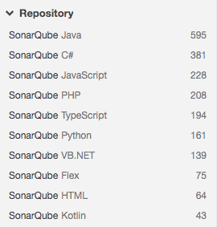

체크스타일 플러그인을 설치한 후의 Rule 목록을 보면 체크스타일 Rule 목록이 추가되어 있는 것을 확인할 수 있다. 총 354개의 Rule이 추가되었다. 

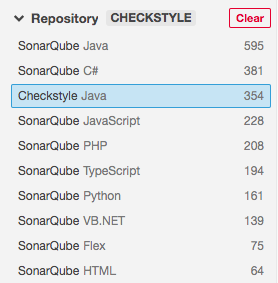

소나큐브에서 체크스타일 Rule을 사용할 수 있는 것이다. 

## 체크스타일 설정하기

소나큐브에서 체크스타일을 설정할 때 주의해야 할 점이 있다. 우리는 지금까지 체크스타일 Rule 설정을 소스 프로젝트 내부에 작성(이전 포스팅의 sun_checks.xml)하였다. 하지만 소나큐브에서는 그 설정을 소나큐브 웹UI에서 하게 되고 소나큐브 서버에서 저장 된다. 그러니 지금까지 작성한 sun_chekcs.xml파일을 소나큐브 설정으로 옮겨야 한다.

일단 연습삼아 체크스타일의 LineLength 룰을 소나큐브에 적용해보자. 체크스타일의 xml파일에서 LineLengh설정은 다음과 같다.

```  xml
  <module name="LineLength">
    <property name="fileExtensions" value="java"/>
  </module>
```

### 체크스타일 룰 확인

소나큐브에서는 Line Length가 어떤 룰로 이뤄져있는지 확인해보자.

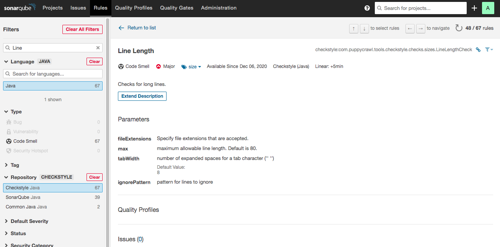

이 설정을 기억하고 Quality Profils를 생성하자. 

### Quality Profile 생성

Quality Profiles를 생성하자. create버큰을 클릭하면 다음과 같이 이름과 언어를 설정하는 부분이 나타난다. 

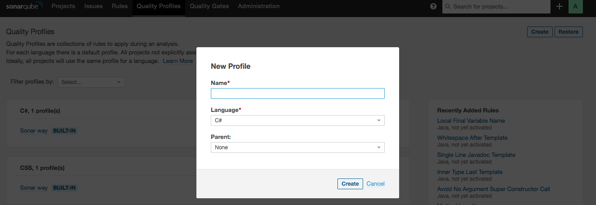

이름은 checkstyle way로 하고 언어는 java를 선택하자. 

### 룰 추가

처음 Quality Profile을 설정하면 활성화 되어 있는 룰이 하나도 없다. 룰을 하나 씩 추가하며 sun_chekcs.xml과 동일한 기능을 하도록 하는 것이다. 이제 Line Length룰을 활성화한다. chekcstyle way설정화면에서 Active more를 클릭하자. 

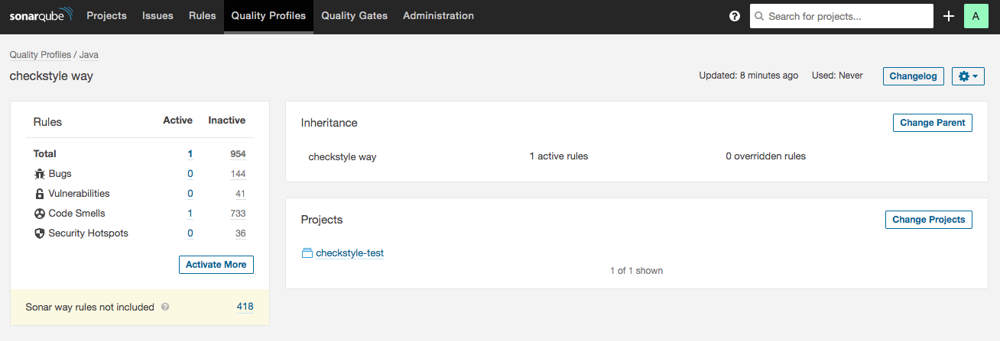

java와 관련된 모든 룰이 다 보이는데 여기서 Line Length 룰을 찾아 Activate를 하자. 그러면 다음과 같이 선택한 룰에서 설정 가능한 항목이 나타난다.

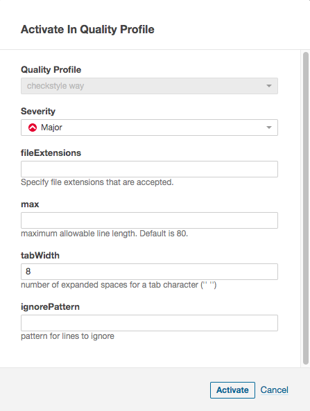

max는 40으로 하고 tabWidth는 4로 설정하자.

### 체크스타일 설정 파일을 이용한 Quality Profile 생성

이번엔 체크 스타일 설정 xml을 이용하여 Quality Profile을 생성해보자. 새로운 Quaility Profile을 생성한다. 

```
Name : checkstyle way2
Language : Java
Parent : None
Checkstyle : checkstyle 포스팅에서 계속 다룬 sun_checkstyle.xml 파일
```

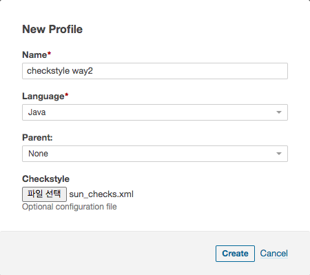

그런데, 아래 오류 메세지가 나타난다. 

> Rule template can't be activated on a Quality profile: checkstyle:com.puppycrawl.tool...

이유가 뭘까? 

체크스타일 rule을 확인해보자. 아래와 같이 `RULE TEMPLATE` 표시가 있는 Rule과 그렇지 않은 Rule이 있다. 

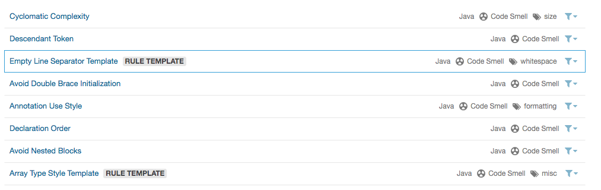

`RULE TEMPLATE` 표시가 없는 rule은 즉시 active 할 수 있지만 표시가 있는 rule은 activate를 바로 할 수 없다. 대신 Custome Rules을 생성해야 한다.

예를 들어, Final Parameters는 sun_checks.xml에 아래와 같이 설정되어 있다. 

```xml
<module name="FinalParameters" />
```

그런데 Final Parameters가 `RULE TEMPLATE`이기 때문에 오류가 발생한다. 이를 해결하기 위해, Final Parameters에 대한 커스텀 rule을 생성하자. 아래 화면에서 create를 클릭한다. 

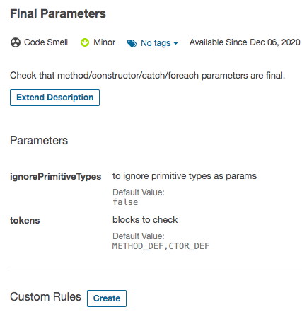

커스텀 룰을 만들 때 Key를 입력하게 되어 있는 이 값을 sun_checks.xml 파일과 맞추어 지정하는 것이 중요하다. Key는 체크스타일 설정파일의 module name과 같도록 해야한다. 아래 그림이 그 예이다. 

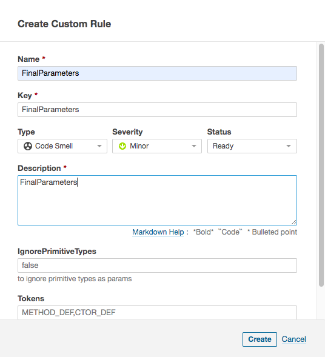

> 주의 : 한번 추가한 커스텀 룰은 삭제가 되지 않는다. 버그인가? delete버튼이 있어 삭제하면 실제로 삭제된 것처럼 보이나, 서버를 재시작하면 삭제했던 룰이 다시 나타나니 이점에 유의하자. 웹UI의 도움말을 보면 의도적으로 삭제하지 않는다고 한다.

지금 까지 설명한 방법으로 sun_checks.xml에 있는 module 중,  소나큐브 체크스타일에서 `RULE TEMPLATE`로 되어 있는 것은 모두 커스텀 룰을 생성해야 한다. module name과 key를 맞추는 것도 있지말자.

커스텀 룰을 모두 생성하였다면 이제 체크스타일 xml설정 파일로 quality profile을 만들 수 있다. 그런데, 이 작업이 생각보다 쉽지 않다. 일일이 모든 module name을 확인해야 한다. 어쩌면, 앞서 설명한 하나 하나 필요한 Rule을 추가하는 것이 더 빠를 수 있다. (필자도 하나 하나 추가 했다)

### Quality Profile에 프로젝트 추가

Quality Profile에 프로젝트를 할당 할 수 있다. 단, 그전에 최소한 한 개 이상의 프로젝트는 추가되어 있어야 한다.

checkstyle way에 적용할 프로젝트를 추가하자. Quality Profile 메뉴에서 checkstyle way를 선택하면 아래와 같은 화면이 나타나며 여기서 Change Projects를 클릭한다.

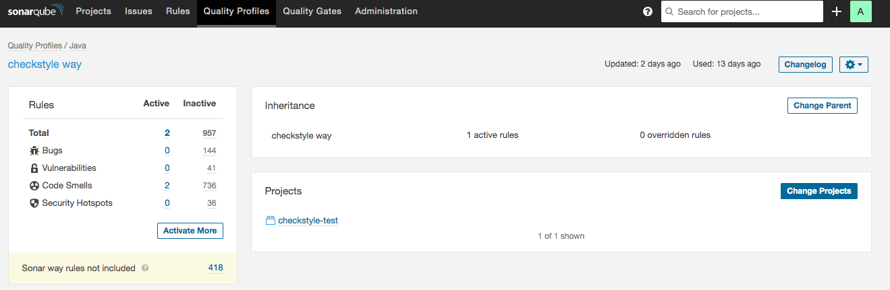 

아래 그림과 같이 선택할 수 있는 프로젝트가 나타난다.  

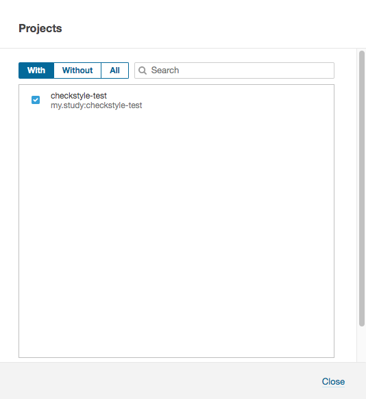

### 룰 확인

룰 탭으로 돌아오면 Rule을 사용하고 있는 Quality Profiles을 확인할 수 있다. 예를 들어, Line Length 룰을 확인하면 다음과 같이 checkstyle way에서 활성화되어 있으며 어떤 옵션이 적용되어 있는지 표시 된다.

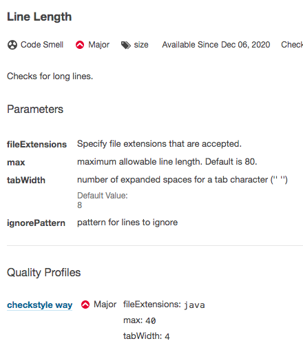

### 코드 분석

코드 분석은 스캔 > 분석의 과정으로 이루어진다. 메이븐을 이용하여 코드 스캔을 할 수 있으며 아래 명령어를 이용한다.

```bash
mvn clean verify sonar:sonar
```

메이븐 프로젝트에 소나큐브를 연동하는 방법은 [소나큐브 설치 플러그인 포스팅](#소나-스캐너-메이븐)을 다시 한번 확인하자.

## 마무리

지금까지 소나큐브를 이용한 체크스타일 활용법을 알아보았다. 하지만 한가지 빠진 부분이 있다. 바로 우리가 직접 작성한 커스텀 체크가 적용되지 않은 것이다. 이 부분은 다음 포스팅에서 다루도록 하겠다.