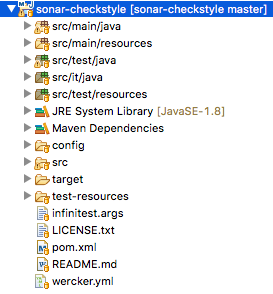
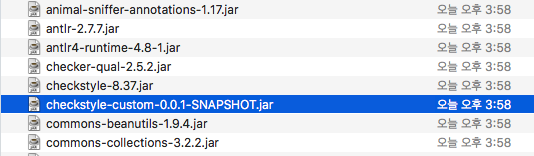
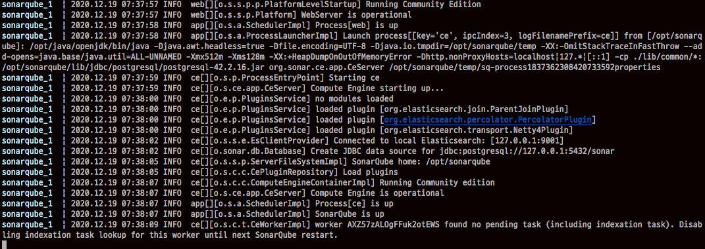
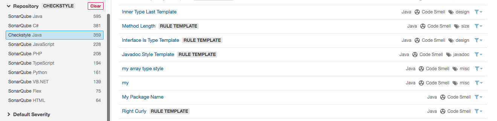
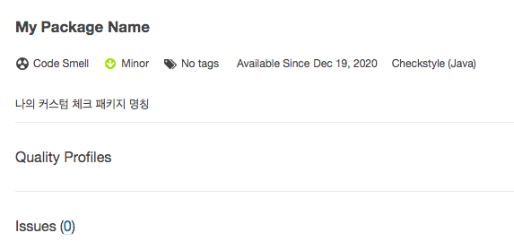

## 개요

소나큐브 체크스타일 플러그인에는 우리가 작성한 커스터 체크가 포함되어 있지 않다. 

내가 체크스타일을 사용하는 큰 이유 중 하나는 직접 작성한 커스텀 체크를 활용하는 것인데 소나큐브 체크스타일 플러그인에서 커스텀 체크를 사용할 수 없다니... 소나큐브에서 체크스타일을 사용하는 것의 의미가 없다. 

그렇다면 어떻게 소나큐브에서 우리가 작성한 커스텀 체크를 사용할 수 있을까? 답은 간단하다, 소나큐브 체크스타일을 플러그인을 직접 수정하면 된다. 

다행히, 소나큐브 체크스타일 플러그인의 소스는 깃헙을 통해 제공되고 있다. 

소나큐브 체크스타일 플러그인을 수정하는 것이 어려운 일이었다면 필자도 이렇게 포스팅을 남기진 않았을 것이다. 우리가 작성한 커스텀 체크 정보를 소나큐브 체크스타일 플러그인에 추가만 해주면 된다. 아이러니 하게 가장 어려운 일은 받은 소스를 컴파일 하는 것이었다. 

그렇다면 천천히 소나큐브 체크스타일 플러그인 소스를 분석해보자.

## 소스받기

소스는 [깃헙 소나 체크스타일](https://github.com/checkstyle/sonar-checkstyle)에서 받을 수 있다. 소스를 받은 후 이클립스에 import한다.



위와 같이 오류없이 소스가 import되면 아주 운이 좋은 것이고 누군가는 오류가 날수도 있는데 이유는 이클립스에 메이븐 컨넥터가 설치되어 있지 않아서 발생하는 오류로 빌드에는 지장이 없다.

## 커스텀 체크 추가

위에서 언급한 대로 소나큐브 체크스타일 플러그인의 소스를 직접 수정할 필요는 없다. 대신 몇 가지 설정만 수정한다.

### 커스텀 체크 모듈 추가

pom.xml 파일을 열어 이전 포스팅 [체크스타일[checkstyle] - 5 : 나만의 체크 만들기]() 에서 작성한 커스텀 체크를 디펜던시에 추가한다.

```xml
...
    <dependency>
        <groupId>org.apache.commons</groupId>
        <artifactId>commons-lang3</artifactId>
        <version>3.10</version>
    </dependency>
    <dependency>
        <groupId>org.reflections</groupId>
        <artifactId>reflections</artifactId>
        <version>0.9.12</version>
    </dependency>
    <!-- 나의 커스텀 체크 추가 -->
    <dependency>
        <groupId>app.my</groupId>
        <artifactId>checkstyle-custom</artifactId>
        <version>0.0.1-SNAPSHOT</version>
        </dependency>
    </dependencies>
...
```

소나 체크스타일 플러그인을 빌드하면 내가 작성한 커스텀 체크 모듈을 포함한다. 

> 주의 : checkstyle-custom은 로컬 리포지토리에 저장되어 있어야 한다. 왜냐하면 checkstyle-custom가 원격 리포지토리(예를 들어, 메이븐 central 리포지토리)에 없기 때문이다. checkstyle-custom 빌드할 때 mvn install 명령어로 로컬 리포지토리에 저장하는 것을 잊지말자.

### Rule 설정 추가 

소나큐브에 추가된 체크스타일 모듈이 무엇인지 알려줘야 하는 작업이다. 소스에서 아래 경로의 파일을 열어보자.

```
/sonar-checkstyle/src/main/resources/org/sonar/plugins/checkstyle/rules.xml
```

이 파일에는 체크스타일에서 사용할 수 있는 모든 Rule이 정의되어 있다. 여기에 우리가 작성한 커스텀 체크 Rule도 추가해야 한다. 아래와 같이 파일 가장 하단에 커스텀 체크라는 주석과 함께 우리가 작성한 커스텀 체크 정보를 기입하였다.

```xml
	<rule
		key="com.puppycrawl.tools.checkstyle.checks.modifier.ClassMemberImpliedModifierCheck">
		<priority>MINOR</priority>
		<name><![CDATA[Class Member Implied Modifier]]></name>
		<configKey><![CDATA[Checker/TreeWalker/ClassMemberImpliedModifier]]></configKey>

		<param key="violateImpliedStaticOnNestedEnum" type="BOOLEAN">
			<defaultValue>true</defaultValue>
		</param>
		<param key="violateImpliedStaticOnNestedInterface"
			type="BOOLEAN">
			<defaultValue>true</defaultValue>
		</param>
	</rule>

	<!-- 커스텀 체크 -->
	<rule key="app.my.checks.MyPackageNameCheck">
		<priority>MINOR</priority>
		<name><![CDATA[My Package Name]]></name>
		<configKey><![CDATA[Checker/TreeWalker/MyPackageName]]></configKey>
	</rule>
</rules>
```

Rule 이름을 My Package Name으로 주었다. configKey 명칭은 체크스타일 설정파일의 module name의 위치가 연관성이 있어 보인다.

### html 파일 추가

다음 경로에 rule의 내용을 정의한 html파일을 추가 한다.

```
${소스폴더}/src/main/resources/org/sonar/l10n/checkstyle/rules/checkstyle
```

파일명은 커스텀 체크 클래스의 full경로명으로 작성한다. 전체경로와 파일명은 다음과 같다. 

```
/sonar-checkstyle/src/main/resources/org/sonar/l10n/checkstyle/rules/checkstyle/app.my.checks.MyPackageNameCheck.html
```

파일내용은 다음과 같이 작성하자.

```
나의 커스텀 체크 패키지 명칭
```

## 빌드

테스트를 포함하여 빌드하면 오류가 발생하기 때문에 테스트를 하지 않고 빌드를 한다. 

```bash
mvn -Pno-validations clean package
```

빌드가 성공하면 `${소스폴더}/target`에 `checkstyle-sonar-plugin-${version}-SNAPSHOT.jar` 파일이 생성된 것을 확인할 수 있다.

이 jar파일의 압축을 풀고 /META_INF/lib 폴더로 가보자. 아래와 같이 커스텀 체크 모듈(checkstyle-custom-0.0.1-SNAPSHOT.jar)이 존재하는지 확인하자. 



## 플러그인 다시 설치

원래 설치되어 있던 소나큐브 체크스타일 플러그인을 제거하고 앞에서 빌드한 커스텀 체크모듈을 포함하는 소나큐브 체크스타일을 추가하자. 플러그인 추가를 위한 자세한 내용은 앞선 포스팅  [체크스타일[checkstyle] - 6 : with sonarqube]() 을 참조하자.

플러그인에 문제가 있다면 소나큐브 서버가 재기동 되지 않으니 서버를 기동 시 콘솔창의 로그를 잘 확인하도록 하자.



## Rule 확인

서버가 재기동 된 후, Rule 메뉴에서 체크스타일 Rule을 확인하면 아래와 같이 우리가 작성한 커스텀 체크의 Rule이 나타난다. (감격!)



상세 정보를 확인하면 다음과 같다.



우리가 html에 작성한 `나의 커스텀 체크 패키지 명칭` 내용이 나타난다. 

## 마무리

이것으로 필자가 체크스타일을 사용한 경험을 마무리 하겠다. 

체크스타일의 기본적인 내용으로 시작하여 커스텀 체크를 작성하는 방법을 알아보았고 메이븐 플러그인, 이클립스 플러그인, 소나큐브 플러그인을 이용하여 더욱 편하게 체크스타일을 사용하는 방법을 알아보았다.

프로젝트 마다 지켜야 할 고유의 명명 규칙과 소스코드 작성 규칙이 있지만 지금까지 공부한 체크스타일을 이용하여 해당 규칙을 검사하는 것을 자동화 할 수 있을 것으로 기대한다.