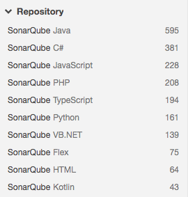
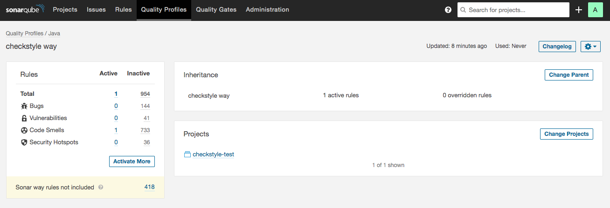

## 소나큐브란 ? 

체크스타일을 시리즈로 포스팅하다가 갑자기 왠 소나큐브를 이야기 하냐고? 아는 사람은 알겠지만 소나큐브는 코드인스펙션 영역에서 아주 유명한 도구이다. 궁금한 사람은 나의 [소나큐브 설치 플러그인 포스팅](https://dololgun.github.io/sonarqube/sonarqube/) 을 참고하자. 

## 소나큐브 체크스타일 플러그인

체크스타일은 소나큐브를 지원하는 플러그인이 있다. 이 플러그인이 하는 역할을 소나큐브를 통해 체크스타일의 코드인스펙션 기능을 실행하는 것이다. 물론, 실행 된 결과도 소나큐브를 통해서 확인할 수 있으며 체크스타일의 다양한 코딩 룰도 소나큐브를 통해서 설정할 수 있다.

### 플러그인 설치

소나큐브 플러그인을 설치하는 방법은 2가지가 있다. 자동으로 설치하는 방법이 편하긴하나 나는 수동으로 설치하는 방법을 사용하겠다. 이유는 나중에 설명하겠다. 먼저, [소나큐브 체크스타일 플러그인](https://github.com/checkstyle/sonar-checkstyle/releases)을 받자. `checkstyle-sonar-plugin-8.37.jar` 파일을 받을 수 있는데 이 파일을 자신의 소나큐브가 설치되어 있는 폴더의 다음 경로에 위치시킨다. 

플러그인 파일 경로 : 

```
${소나큐브 익스텐션 폴더}/plugins
```

> [메모] : 소나큐브 익스텐션 폴더의 위치는 자신이 소나큐브를 설치한 위치에 따라 다르다. 필자는 소나큐브를 도커 이미지로 설치했으며 컨테이너에서 지정되어 있는 소나큐브 익스텐션 폴더를 호스트의 볼륨과 매칭하였다.

jar파일을 이동하였다면 소나큐브를 재시작한다. 

무엇이 달라졌을까? 유심히 보지 않으면 알아채기가 쉽지 않다. 

체크스타일 플러그인을 적용하기 전의 소나큐브 규칙목록은 다음과 같다. (소나큐브 웹UI의 규칙 탭에서 확인할 수 있다)



체크스타일 플러그인을 설치한 후의 규칙목록을 보면 체크스타일 규칙목록이 추가되어 있는 것을 확인할 수 있다. 총 354개의 규칙이 추가되었다. 


소나큐브에서 체크스타일 규칙을 사용할 수 있는 것이다. 

## 소나큐브에서 체크스타일 설정하기

소나큐브에서 체크스타일을 설정할 때 주의해야 할 점이 있다. 우리는 지금까지 체크스타일 룰 설정을 소스 프로젝트 내부에 작성하였다. 하지만 소나큐브에서는 그 설정을 소나큐브 웹UI에서 하게 되고 그 설정도 소나큐브 서버에서 관리 된다. 그러니 지금까지 작성한 sun_chekcs.xml파일을 소나큐브 설정으로 옮겨야 한다.

일단 연습삼아 체크스타일의 LineLength 룰을 소나큐브에 적용해보자. 체크스타일의 xml파일에서 LineLengh설정은 다음과 같다.

```  xml
  <module name="LineLength">
    <property name="fileExtensions" value="java"/>
  </module>
```

### 체크스타일 룰 확인

소나큐브에서는 Line Length가 어떤 룰로 이뤄져있는지 확인해보자.


이 설정을 기억하고 Quality Profils를 생성하자. 

### Quality Profiles 생성

Quality Profiles를 생성하자. create버큰을 클릭하면 다음과 같이 이름과 언어를 설정하는 부분이 나타난다. 


이름은 checkstyle way로 하고 언어는 java를 선택하자. 

### 룰 추가

처음 Quality Profile을 설정하면 활성화 되어 있는 룰이 하나도 없다. Line Length룰을 활성화한다. chekcstyle way설정화면에서 Active more를 클릭하자. 



java와 관련된 모든 룰이 다 보이는데 여기서 Line Length 룰을 찾아 Activate를 하자. 그러면 다음과 같이 해당 룰에서 설정 가능한 항목이 나타난다.


max는 40으로 하고 tabWidth는 4로 설정하자.

### 프로젝트 추가

checkstyle way에 적용할 프로젝트를 추가하자. 위의 룰추가를 위해 들어간 화면에서 Change Projects를 이용하여 프로젝트를 추가하자. 

### 룰 확인

룰 탭으로 돌아와 Line Length 룰을 확인하면 다음과 같이 checkstyle way에서 활성화되어 있으며 옵션으로 설정되어 있는 값도 표시 된다.


### 코드 분석

```bash
mvn clean verify sonar:sonar
```

