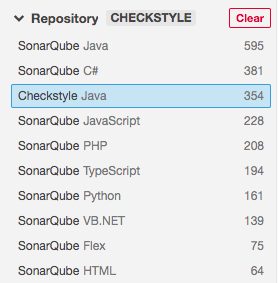

## 소나큐브란 ? 

체크스타일을 시리즈로 포스팅하다가 갑자기 왠 소나큐브를 이야기 하냐고? 아는 사람은 알겠지만 소나큐브는 코드인스펙션 영역에서 아주 유명한 도구이다. 궁금한 사람은 나의 [소나큐브 설치 플러그인 포스팅](../sonarqube.md) 을 참고하자.

## 소나큐브 체크스타일 플러그인

체크스타일은 소나큐브를 지원하는 플러그인이 있다. 이 플러그인이 하는 역할을 소나큐브를 통해 체크스타일의 코드인스펙션 기능을 실행하는 것이다. 물론, 실행된 결과도 소나큐브를 통해서 확인할 수 있으며 체크스타일의 다양한 코딩 룰도 소나큐브를 통해서 설정할 수 있다.

### 플러그인 설치

소나큐브 플러그인을 설치하는 방법은 2가지가 있는데 이번엔 수동으로 설치하는 방법을 사용하겠다. 먼저, 소나큐브 체크스타일 플러그인](https://github.com/checkstyle/sonar-checkstyle/releases)을 받자. `checkstyle-sonar-plugin-8.37.jar` 파일을 받을 수 있는데 이 파일을 자신의 소나큐브가 설치되어 있는 폴더의 다음 경로로 이동시킨다. 

플러그인 파일 경로 : 

```
${소나큐브 익스텐션 폴더}/plugins
```

> [메모] : 소나큐브 익스텐션 폴더의 위치는 자신이 소나큐브를 설치한 위치에 따라 다르다. 필자는 소나큐브를 도커 이미지로 설치했으며 컨테이너에서 지정되어 있는 소나큐브 익스텐션 폴더를 호스트의 볼륨과 매칭하였다.

jar파일을 이동하였다면 소나큐브를 재시작한다. 

무엇이 달라졌을까? 유심히 보지 않으면 알아채기가 쉽지 않다. 

체크스타일 플러그인을 적용하기 전의 소나큐브 규칙목록은 다음과 같다. (소나큐브 웹UI의 규칙 탭에서 확인할 수 있다)


체크스타일 플러그인을 설치한 후의 규칙목록을 보면 체크스타일 규칙목록이 추가되어 있는 것을 확인할 수 있다.



소나큐브의 규칙으로 체크스타일 규칙을 사용할 수 있는 것이다. 

