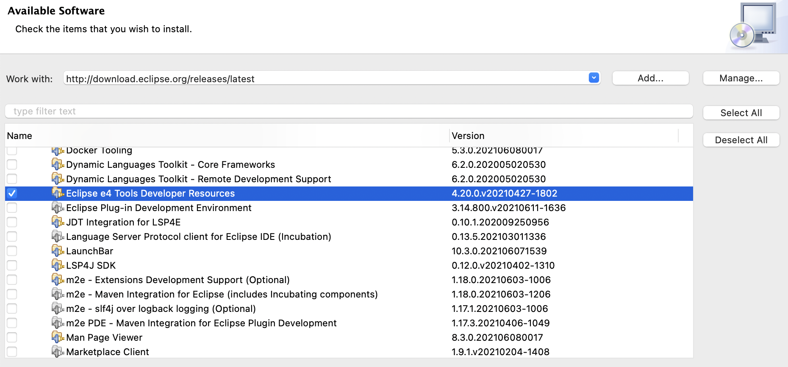
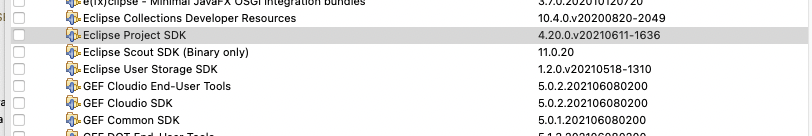
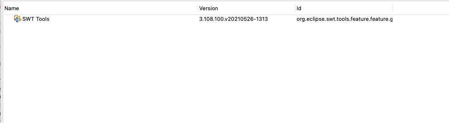
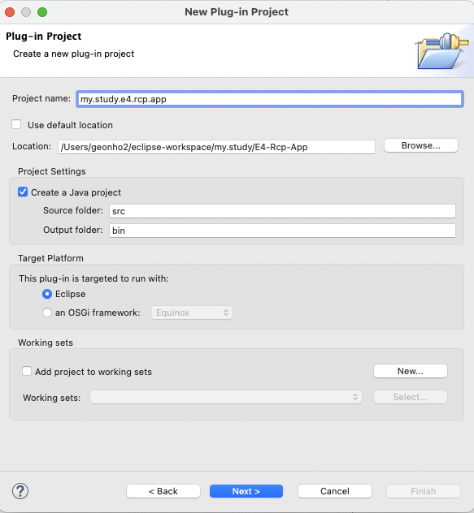
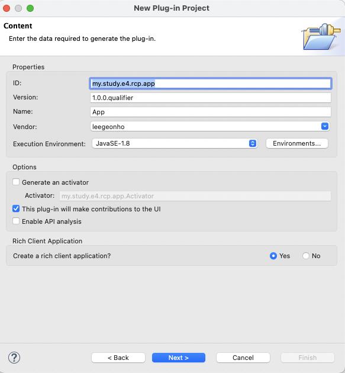
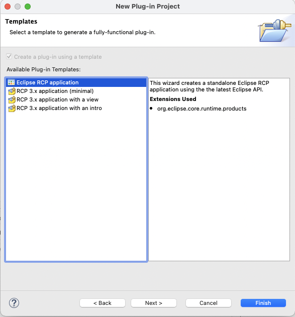
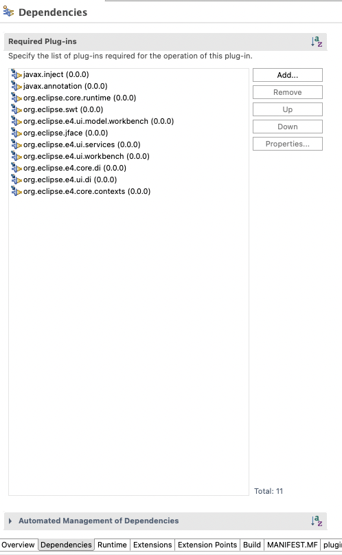
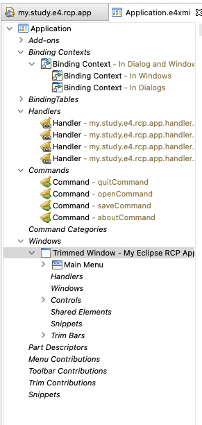

### 1. RCP

자바 기반의 UI 어플리케이션을 이클립스 개발 플랫폼 기반에 만드는 것을 의미한다.

즉, 우리가 Java개발을 위해 활용하는 (흔히 이클립스라고 부른다) 툴도 이클립스 플랫폼을 기반으로 개발된 RCP라고 생각하면 된다.

다음은 그림은 RCP 애플리케이션을 구성하는 컴포넌트를 보여준다.


### 2. 설치

#### 2.1. Eclipse SDK 받기

이클립스의 install software 메뉴에서 다음 주소를 입력한다.

```
http://download.eclipse.org/releases/latest
```

아래와 같이 Eclipse e4 Tools Developer Resources를 설치한다.



> 현재 기준으로 최신버전은 4.20.0.v20210427-1802 이다.





#### 2.2. Install the e4 spies

이클립스 애플리케이션을 분석하는데 유용한 e4 spies를 설치한다.

```
http://download.eclipse.org/e4/snapshots/org.eclipse.e4.tools/latest/
```

다수의 플러그인이 나오는데 어떤 것을 설치할지 모르겠다면 일단, 전체 설치를 해보자.

### 3. 연습: 마법사로 RCP 애플리케이션 만들기

이클립스 rcp 애플리케이션을 생성해보도록하자.

file > new > other > plug-in project 선택.

아래와 같이 만든다.



아래아 같이 jdk는 1.8로 설정하고 `This plug-in will make contributions to the UI` 에 체크를 하고 **Crate a rich client application**을 **Yes** 로 한다. 그리고 Next를 선택한다.



아래와 같이 Eclipse RCP application 선택한다.



마지막 위자드에서 `Create sample content` 체크를 한다. 

프로젝트를 생성하면, 오류가 발생할 수 있는데, 필자의 경우 `SamplePart.java` 에서 `import javax.annotation.PostConstruct` 를 찾을수 없다는 메시지가 나왔다. 이럴경우, plugin.xml의 dependencies 탭에서 javax.annotation을 추가하면 해결된다.



### 4. 애플리케이션 구조 

이클립스 애플리케이션의 런타임 구조는 *application model* 로 설명된다.

이 모델은 모델 엘리멘트의 집합으로 구성되는데, 각 모델 엘리멘트는 트리구조를 가지고 있다. 애플리케이션에 우리 눈에 보이는 비주얼 엘리멘트가 있는 반면, 우리눈에 보이지 않는 엘리멘트도 있다.



각 모델 엘리멘트는 현재상태를 나타내는 애트리뷰트를 가지고 있다. (예를 들어, size와 윈도우의 position 등). 그리고 필요하다면 하나의 모델 엘리멘트는 자바소스 또는 정적 리소스와 연결될 수 있다. 예를 들어, part는 part가 보이게 될 때, 이를 초기화 하는 java classes와 연결된다.

애플리케이션 모델은 정적인 파일로 기술되며, RCP 애플리케이션에서는 이 파일이 기본으로 `Application.e4xmi` 이다.

#### 4.1. 모델 엘리멘트와 자바클래스/리소스의 연결

URI(Uniform Resource Identifier)를 통하여 연결할 수 있다.

이클립스는 2개의 URI패턴을 정의하고 있다. 왠만하면 URI를 통한 연결은 lazy 초기화 된다.

1. ```
   bundleclass://Bundle-SymbolicName/package.classname
   예) bundleclass://test/test.parts.MySavePart
   
   // bundleclass://는 정해진 prefix이다. 번들 심볼릭네임은 MANIFEST.MF 파일에 기술되어 있다. 그 다음에 / 가 오고 그 이후로 클래스의 full name이 온다.
   ```

2. ```
   platform:/plugin/Bundle-SymbolicName/path/filename.extension
   예) platform:/plugin/com.example.plugin/icons/save_edit.gif
   
   // 리소스를 위해 사용. platform:/plugin/은 정해진 prefix이다.  
   ```

#### 4.2. 모델 오브젝트 개괄

##### 4.2.1. Application


## 출처

[Eclipse RCP (Rich Client Platform) - Tutorial (vogella.com)](https://www.vogella.com/tutorials/EclipseRCP/article.html)