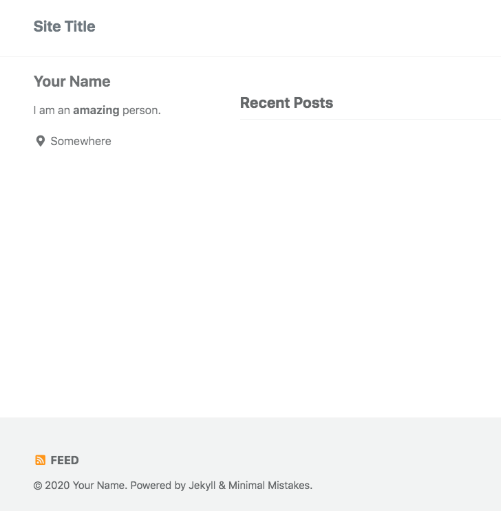

## 나의 깃헙 블로그 리포지토리 만들기

깃헙에 리포지토리를 만든다. 리포지토리 이름은 다음 명명 규칙을 꼭 지켜야 한다. 

```
[깃헙아이디].github.io
```

이렇게 하는 것만으로 웹브라우저 주소에 `[깃헙아이디].github.io`를 치고 들어가면 자신의 블로그가 접속되는 것을 확인할 수 있다.

## 제킬(Jekyll)과 깃헙과의 관계

깃헙을 통해 블로그를 개설하기는 했지만 깃헙이 네이버블로그나 워드프레스와 같은 블로그 서비스를 제공하는 것은 아니다. 즉, 나의 깃헙 페이지를 여느 블로그와 비슷하게 보이도록 하기 위해서는 직접 웹페이지를 만들어야 한다. 그럼 왜? 깃헙을 블로그로 사용하는 것일까?

깃헙은 이런 작업을 편하게 할 수 있도록 제킬을 지원한다. 제킬은 정적 웹페이지를 쉽게 제작할 수 있는 도구이다. 자세한 정보는 [여기](../jekyll/2020-08-23-jekyll이란.md)를 참조하기 바란다.

깃헙 블로그에서 내 웹사이트가 생성되는 흐름을 간략히 설명하면 (사실 정확한 건 아니지만) 다음과 같다. 

1. 블로그에 올리고 싶은 컨텐츠를 마트다운 또는 HTML과 같은 포맷으로 작성한다.
2. 자신의 깃헙 블로그 리포지토리에 생성한 컨텐츠를 푸시한다.
3. 깃헙은 컨텐츠가 올라온 것을 인식하고 제킬을 이용하여 웹 사이트를 생성한다. (1번에서 작성한 컨텐츠가 웹페이지에서 보여질 수 있는 파일로 재생성된다)
4. 블로그에 접속하면 3번에서 생성된 웹페이지가 보여지게 된다.

## 블로그 테마 결정

깃헙이 제킬을 지원하기 때문에 제킬에서 사용할 수 있는 다양한 테마를 깃헙 블로그에서도 사용할 수 있다. 다양한 제킬 테마를 [jekyllthemes.org](http://jekyllthemes.org/) 에서 살펴보고 자신이 원하는 테마를 설치하여 사용하면 된다. 나는 [minimal-mistake](https://mmistakes.github.io/minimal-mistakes/)라는 테마를 설치하기로 하였다. 이유는 깃헙 블로그 만들기 위해 웹 서핑을 할 때 특정 가이드의 예제가 바로 이 테마였기 때문이다. 테마를 잘 적용해보고 그 경험을 살려 여러 테마를 바꿀 예정이다.

## minimal-mistake 테마 설치

### (선택) 로컬PC에 테마 설치하기

이 과정은 자신의 깃헙 블로그를 생성하는 것과 큰 상관이 없기 때문에 그냥 넘어가도 되지만 제킬과 깃헙의 동작원리를 좀 더 정확하게 이해하고 싶다면 꼭 따라해볼 것을 추천한다.

또한, 우리가 작성한 컨텐츠에 제킬에서 요구하는 문법에 어긋난 부분이 있을 수가 있는데 이럴 때 제킬은 오류를 발생하고 새로운 컨텐츠를 생성하지 않는다.

로컬환경이 아니라면 이런 오류가 발생했다는 것과 어느 부분이 문제인지 알수가 없다. 로컬환경에서는 제킬 명령어를 이용하여 문제가 발생했고 원인이 무엇인지 알수가 있다. 자세한 경험담은 기회가 되면 블로그에 남기도록 하겠다.

로컬에 테마를 설치하기 위해서는 PC에 루비 라이브러리(젬)를 실행할 수 있는 환경이 구성되어야 한다. 필자는 mac을 사용하며 관련된 포스트를 [mac에 ruby설치](../macos/2020-08-26-mac-ruby-reinstall-post.md)에 올려놨다.

루비가 설치됐다면 제킬을 설치해야한다. 다음 [포스트](../jekyll/2020-08-23-jekyll이란.md) 의 테스트 사이트 시작을 참고하자.

먼저, 자신의 PC 특정 디렉토리에에서 다음 명령어를 실행하여 제킬 템플릿 사이트를 생성한다.

```shell
$ jekyll new minimal-mistake-local
```

정상적으로 수행된다면 `minimal-mistake-local` 폴더가 생성됐을 것이다. 생성된 폴더로 들어가보자. 폴더안에 자동으로 생긴 파일들은 웹 사이트를 구축하기 위한 샘플파일들이다. 

불 필요한 파일인 `_posts/0000-00-00-welcome-to-jekyll.markdown`, `about.markdown`, `404.html` 를 삭제한다. 

[테마의 깃헙 리포지토리](https://github.com/mmistakes/minimal-mistakes)를 방문하여 _config.yml의 내용을 복사하여 로컬에 _config.yml에 덮어쓰자. 파일의 내용을 보면 아래와 같이 주석처리된 부분이 보일 것이다. 

```yaml
# theme                  : "minimal-mistakes-jekyll"
# remote_theme           : "mmistakes/minimal-mistakes"
```

둘중에 하나는 주석을 풀어야 한다. 의미는 다음과 같다.

* theme를 사용 : minimal-mistakes테마를 로컬에 다운받아 사용하는 방법
* remote-theme를 사용 : 원격지에 있는 테마를 사용하는 방법(원격지에 테마는 깃헙 블로그로 예상된다)

이 예제에서는 remote_theme를 사용하기로 한다. remote_the

me에 주석을 해제하자.

_config.yml파일에 repository항목도 자신의 깃헙 리포지토리로 설정한다. 

```yaml
repository               : "자신의 깃헙리포지토리주소" # GitHub username/repo-name e.g. "mmistakes/minimal-mistakes"
```

다음으로 테마의 깃험 리포지토리의 index.html파일의 내용을 복사하여 로컬에 `index.markdown` 에 덮어쓴다. 그 후 이름을 `index.html` 로 변경한다.

로컬의 Gemfile을 다음과 같이 수정하자. 영어로 되어 있는 주석을 보면 알겠지만 리모트 테마를 사용할 때와 아닐 때의 설정이 다르다. 또한 운영체제가 mac인경우와 window인 경우도 다른다. 그리고 이 테마에서 필요한 플러그인 몇 가지를 jekyll_plugin에 추가하였다.

```ruby
source "https://rubygems.org"
# Hello! This is where you manage which Jekyll version is used to run.
# When you want to use a different version, change it below, save the
# file and run `bundle install`. Run Jekyll with `bundle exec`, like so:
#
#     bundle exec jekyll serve
#
# This will help ensure the proper Jekyll version is running.
# Happy Jekylling!
# gem "jekyll", "~> 4.1.1"
# This is the default theme for new Jekyll sites. You may change this to anything you like.
# gem "minima", "~> 2.5"
# gem "minimal-mistakes-jekyll" 

# If you want to use GitHub Pages, remove the "gem "jekyll"" above and
# uncomment the line below. To upgrade, run `bundle update github-pages`.
gem "github-pages", group: :jekyll_plugins

# If you have any plugins, put them here!
group :jekyll_plugins do
  gem "jekyll-feed", "~> 0.12"
  gem "jekyll-paginate"
  gem "jekyll-sitemap"
  gem "jekyll-gist"
  gem "jekyll-include-cache"
end

# Windows and JRuby does not include zoneinfo files, so bundle the tzinfo-data gem
# and associated library.
#platforms :mingw, :x64_mingw, :mswin, :jruby do
#  gem "tzinfo", "~> 1.2"
#  gem "tzinfo-data"
#end

# Performance-booster for watching directories on Windows
# gem "wdm", "~> 0.1.1", :platforms => [:mingw, :x64_mingw, :mswin]
```

여기까지 진행 후 로컬 폴더의 모습은 다음과 같다. 

```bash
Gemfile
Gemfile.lock
_config.yml
_posts
index.html
```

이제 다음 명령어로 로컬 웹서버를 기동하자.

```bash
$ bundle exec jekyll serve
```

아래와 같이 서버가 기동되었다는 메세지가 보이면 성공이다.

```bash
Configuration file: /Users/geonho/Documents/minimal-mistake-local/_config.yml
            Source: /Users/geonho/Documents/minimal-mistake-local
       Destination: /Users/geonho/Documents/minimal-mistake-local/_site
 Incremental build: disabled. Enable with --incremental
      Generating...
      Remote Theme: Using theme mmistakes/minimal-mistakes
       Jekyll Feed: Generating feed for posts
   GitHub Metadata: No GitHub API authentication could be found. Some fields may be missing or have incorrect data.
                    done in 4.987 seconds.
 Auto-regeneration: enabled for '/Users/geonho/Documents/minimal-mistake-local'
    Server address: http://127.0.0.1:4000/
  Server running... press ctrl-c to stop.
```

웹브라우저를 실행하여 http://127.0.0.1:4000에 접속해 보자.

아무런 설정이 되어 있지 않지만 웹페이지가 보인다면 성공이다. 



### 샘플 컨텐츠 작성해보기

현재 로컬의 _posts 폴더는 비어있는 상태다. 이 폴더에 우리의 포스트를 작성한다.

지금까지 제킬을 사용하여 로컬에서 직접 테마를 설치하고 이 테마를 이용하여 웹 서버를 기동하여 보았다. 이 과정을 통해 제킬이 어떻게 동작하는지 이해했기를 바란다. 예측컨데 깃헙도 이와 비슷한 방식으로 제킬과 연동하여 


## 참조

https://dreamgonfly.github.io/blog/jekyll-remote-theme/

