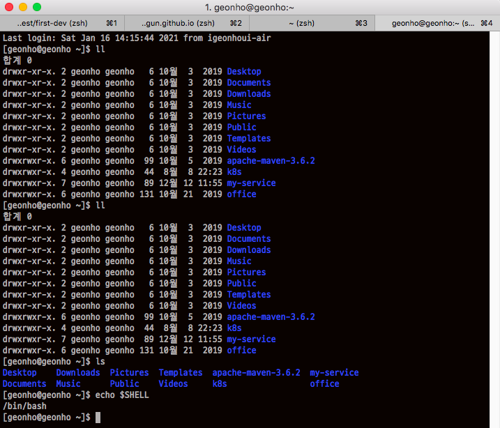

## 쉘(Shell) 이란

쉘이란 운영체제가 사용자와 대화를 할 수 있는 다리 역할을 하는 프로그램이다. 우리가 흔히 사용하는 윈도우 운영체제를 사용하면 이 말을 이해하기 힘들것이다. 왜냐하면 GUI기간의 운영체제를 사용하면 쉘을 사용할 일이 거의 없기 때문이다. 하지만 리눅스, 유닉스 같은 운영체제를 사용하면 쉘을 이용하여 운영체제를 사용하는 경우가 많다. 

위 그림은 필자가 사용하는 쉘이다.

쉘은 종류가 다양한데 일반적으로 많이 사용되는 쉘은 bash이고 요새는 zsh가 많이 사용된다고 한다. 필자도 mac os를 사용할 때는 zsh를 쓰고 linux를 사용할 때는 bash를 사용한다.

그렇다면 현재 내가 사용하고 있는 쉘은 무엇인지 어떻게 알까? 아래 명령어를 사용하면 알 수 있다.

```bash
$ echo $SHELL
/bin/bash
```

위와 같이 내가 사용하는 쉘 프로그램의 경로가 출력된다. 위의 결과는 bash를 사용하는 것으로 나타났다.

또 한가지 궁금한 점이 생길 수 있다. 내가 사용하는 운영체제에서 사용가능한 쉘은 어떻게 알 수 있을까? 아래 명령어를 사용해보자.

```bash
$ cat /etc/shells
/bin/sh
/bin/bash
/usr/bin/sh
/usr/bin/bash
/bin/tcsh
/bin/csh
```

사용 가능한 쉘 목록이 위와 같이 조회된다.

## 로그인 쉘 vs 비로그인 쉘

우리가 쉘을 실행하는 방법은 여러가지가 있다. 

1. 터미널 창의 로그인 프롬프트를 통해서 로그인한다.
2. 이미 로그인 한 상태에서 su - ${유저명}을 이용하여 다른 유저로 변경한다.
3. GUI기반의 운영체제에서 터미널을 열어 해당 유저의 쉘을 실행한다.
4. ssh로 접속하고 나서 다시 bash를 실행한다.

1 ~ 4번 모두 같은 유저이고 이 유저가 bash를 사용한다면 bash를 사용하여 운영체제와 대화를 할 것이다. 하지만 같은 bash라 할지라도 1번의 경우만 로그인 쉘로 동작하고 2,3,4번의 경우 비로그인 쉘로 동작한다. 비로그인 쉘은 로그인 없이 실행하는 Shell을 말한다.

그렇다면, 로그인 쉘과 비로그인 쉘은 어떻게 다를까? 그전에 우리가 로그인 할 때 어떤 일이 일어나는지 알아야 한다. 

### 로그인 시 일어나는 일

로그인 쉘이 bash인 경우를 예로 들어보자. 운영체제는 알아서 다음 과정으로 쉘 스크립트를 수행한다.

1. /etc/profile
2. `~/.bash_profile` or `~/.bash_login` or `~/.profile`
3. ~/.bashrc
4. /etc/bashrc

로그인 쉘이 동작하는 경우 1~4번 과정이 모두 수행되지만 비로그인 쉘이 동작하는 경우 3~4번 과정만 수행된다. 

우리가 또 숙지해야 할 것이 있는데 위의 스크립트 파일은 사용자별, 쉘별로 수행되는 것이 다르다는 것이다.

### 사용자 별 구분

파일의 위치가 `/etc` 하위 인지 `~/`  하위 인지에 따라 모든 사용자, 특정 사용자인지가 결정된다. 즉, 2번과 3번 과정은 사용자의 홈디렉터리(~/)에 파일이 존재하면 실행되고 존재하지 않으면 실행되지 않는다. 일반적으로 자신이 직접 추가하지 않으면 이런 파일들은 생성되지 않는다. 반대로 1번과 4번은 사용자와 상관없이 무조건 수행된다. 단, 어떤 쉘을 사용하느냐에 따라 수행될수도 안될 수도 있는 파일이 있다.

### 쉘 별 구분

.bash_profile과 .bash_login, .bashrc, /etc/bashrc는 bash전용이다. bash로 로그인 하는 경우만 수행된다는 말이다. 이와 비슷하게 다른 쉘들도 자신만의 로그인 스크립트가 있다. 이와 반해 .profile은 쉘과 상관없이 수행된다.

 ## /etc/profile 효과적으로 수정하기

/etc/profile 의 내용을 살펴보면 기본 설정을 위한 스크립트가 작성되어 있다. 그 중, 아래와 같은 스크립트를 살펴볼 수 있다. (CentOS7을 기준)

```sh
for i in /etc/profile.d/*.sh /etc/profile.d/sh.local ; do
    if [ -r "$i" ]; then
        if [ "${-#*i}" != "$-" ]; then
            . "$i"
        else
            . "$i" >/dev/null
        fi
    fi
done
```

/etc/profile.d 폴더에 .sh로 끝나는 모든 파일을 실행한다. 그렇기 때문에 /etc/profile 스크립트를 추가할 일이 생길 때 이 파일을 직접 수정하지말고 스크립트의 역할을 잘 표현하는 .sh로 끝나는 파일명을 작성하여 /etc/profile.d 폴더에 추가하는 것이 관리차원에서 더 좋다.

## 결론

쉘 초기화 스크립트의 동작 특성을 잘 이해하고 내가 추가하고자 하는 스크립트가 어떤 파일에 들어가야 하는지 잘 결정하는 것이 중요하다.

## 참조

https://webdir.tistory.com/126#:~:text=SHELL%20%2Fbin%2Fbash-,Login%20shell%20vs%20Non%2Dlogin%20shell,%ED%95%98%EC%97%AC%20%ED%99%98%EA%B2%BD%EC%9D%84%20%EC%84%A4%EC%A0%95%ED%95%9C%EB%8B%A4.

