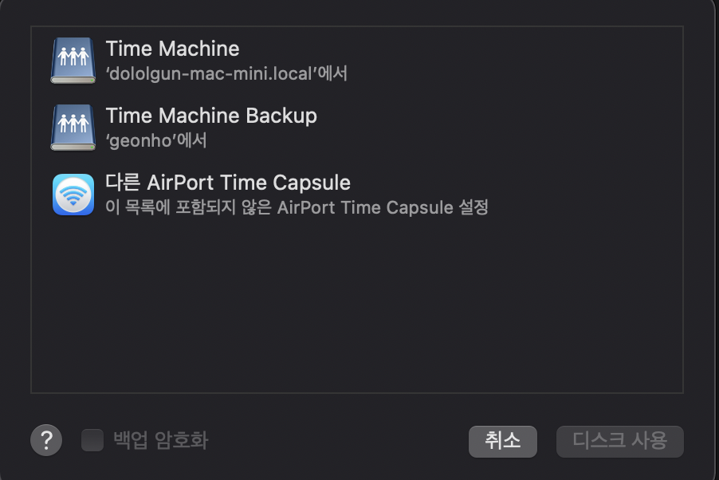

맥에서 사용하는 타임머신의 스토리지 서버를 리눅스에 설치한다.

이를 위해 리눅스 서버에 2가지가 필요하다. 

* samba 서비스
* Avahi : 네트워크에서 자신의 네트워크 공유를 자동으로 감지할 수 있도록 한다.

Avahi 를 사용하는 이유는 이렇게 해야 mac에서 이 서버를 인식할 수 있다. 

 ### Avahi 도커 설치 하기

```bash
$ sudo docker create --name avahi-config solidnerd/avahi:0.7
$ sudo docker cp avahi-config:/etc/avahi .
$ sudo docker rm avahi-config
```

### Avahi 도커 설정 하기

```bash
$ sed -i 's/#enable-dbus=yes/enable-dbus=no/' avahi/avahi-daemon.conf
```

### Avahi Samba 설정하기

```xml
$ cat <<EOT >> avahi/services/smb.conf
<?xml version="1.0" standalone='no'?>
<!DOCTYPE service-group SYSTEM "avahi-service.dtd">
<service-group>
<name replace-wildcards="yes">%h</name>
<service>
  <type>_adisk._tcp</type>
  <txt-record>sys=waMa=0,adVF=0x100</txt-record>
  <txt-record>dk0=adVN=Time Capsule,adVF=0x82</txt-record>
</service>
<service>
  <type>_smb._tcp</type>
  <port>445</port>
</service>
<service>
  <type>_device-info._tcp</type>
  <port>0</port>
  <txt-record>model=RackMac</txt-record>
</service>
</service-group>
EOT
```

>주의
>
>selinux가 활성화되어 있다면 samba와 avahi 사용에 각종 보안 제약으로 어려움이 따른다. selinux를 비활성화 하자. 

## 위와 같이 했는데도 안됐다.

혹시 되는 사람은 그대로 하되 안되면 필자가 했던 방법을 참고한다.

### 중요한건 samba 설정

타임머신을 위한 공유폴더 설정을 다음과 같이 한다. 아래 예시는 타임머신에 필요한 설정만 보여주었다.

```ini
[global]
  workgroup = SAMBA
  security = user

  passdb backend = tdbsam

  printing = cups
  printcap name = cups
  load printers = yes
  cups options = raw

  min protocol = SMB2

[Time Machine Backup]
  path = /mnt/LGH2/tmbackup/data
  browseable = yes
  read only = no
  force create mode = 0660
  force directory mode = 2770
  valid users = @samba @geonho
  vfs objects = fruit streams_xattr
  fruit:time machine = yes
  fruit:time machine max size = 500G
  fruit:delete_empty_adfiles = yes
  fruit:veto_appledouble = no
  fruit:wipe_intentionally_left_blank_rfork = yes
```

위에서 설정한 avahi 도커는 실행할 필요가 없었다. 중요한 것은 `vfs objects = fruit streams_xattr` 설정으로 보이는데 잘 모르겠다.

관련된 설명은 다음과 같긴한데,

```
vfs object
This parameter is a synonym for vfs objects.

vfs objects (S)
This parameter specifies the backend names which are used for Samba VFS I/O operations. By default, normal disk I/O operations are used but these can be overloaded with one or more VFS objects. Be aware that the definition of this parameter will overwrite a possible previous definition of the vfs objects parameter.

Default: vfs objects =

Example: vfs objects = extd_audit recycle
```

일단 위와 같이 설정하고 samba를 재시작 한 후, 맥에서 보면 아래와 같이 나온다ㅣ. 



Time Machine 은 필자가 가지고 있는 맥미니 서버에서 항상 잘 나오는 것이고 Time Machine Backup은 이 포스티에서 다루는 리눅스에서 설정한 백업 폴더이다. 

그런데, 처음엔 잘 나오다가 특정 시점이 지나면 리눅스에서 설정한 백업 폴더가 나타나지 않았다. 예를 들어, 클라이언트 맥을 재시작 하면 나오지 않았다. 

그러다가, 리눅스 서버의 타임머신 공유 폴더를 smb로 직접 연결하면 다시 보였다.

> 주의
>
> fruit:time machine max size를 설정하지말자 이것을 설정하면 디스크에 이미지를 할당할 수 없다는 오류가 뜬다.

### 타임머신을 위한 설정

```ini
[global]
        workgroup = SAMBA
        security = user

        passdb backend = tdbsam

        printing = cups
        printcap name = cups
        load printers = yes
        cups options = raw

        min protocol = SMB2
        vfs objects = catia fruit streams_xattr
        fruit:aapl = yes
        fruit:model = MacSamba

[timemachine]
        path = /mnt/LGH2/tmbackup/data
        browseable = yes
        read only = no
        writable = yes
        create mask = 0644
        directory mask = 0755
#       force create mode = 0660
#       force directory mode = 2770
        valid users = @samba @geonho

# following option for timemachine
        fruit:time machine = yes
#       fruit:time machine max size = 500G
#       fruit:metadata = stream
#       fruit:advertise_fullsync = true
#       fruit:veto_appledouble = no
#       fruit:posix_rename = yes
#       fruit:zero_file_id = yes
#       fruit:wipe_intentionally_left_blank_rfork = yes
#       fruit:delete_empty_adfiles = yes
#       inherit acls = Yes
        durable handles = yes
        kernel oplocks = no
        kernel share modes = no
        posix locking = no
```


## 참조

https://www.samba.org/samba/docs/current/man-html/vfs_fruit.8.html

https://wiki.samba.org/index.php/Configure_Samba_to_Work_Better_with_Mac_OS_X
