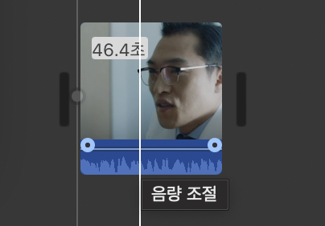
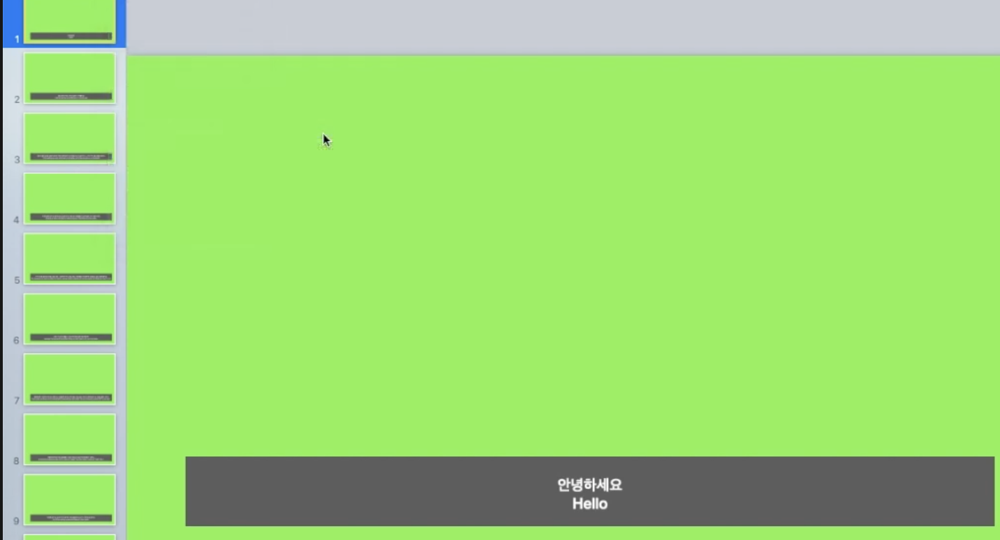

### 동영상 볼륨 조절

아래 그림과 같이 마우스를 가져다 대면 동영상의 볼륨을 조절할 수 있다.

### 필요없는 영상 삭제

필요없는 영상의 구간에 마우스 우클릭하여 `클립분리`를 선택하면 동영상이 분리가 된다.

분리된 클릭을 선택하면 노란색 테두리로 감싸지고 삭제를 선택하면 노란색으로 선택된 클립이 삭제된다.

### 음악

유투브 스튜디오로 이동하여 오디오 보관함에 가면 무료 오디오가 제공된다. 이 오디오를 다운받아 아이무비 클립에 추가한다. 마찬가지로 볼륨을 조절할 수 있고 클립을 분리하여 자를 수 있다. 

### 전환효과

전환효과를 선택하여 클립이 분리되는 곳에 가져다 놓으면 클리이 전환되면서 효과가 나타난다. 

### 자막넣기

타이틀 메뉴로 가면 여러가지 타이틀을 넣을 수 있는데 이것이 자막을 넣는 역할을 한다. 원하는 자막 스타일을 선택하고 아래 클립 타임라인에 끌어다 넣고 시간을 조절한다.

### 자막쉽게넣기

키노트에서 배경색을 초록색으로 하고 자막을 덮는다. 그리고 각 슬라이드를 15초 정도로하고 동영상으로 익스포트한다.

위의 영상을 아이무비로 가져가서 오른쪽 상단 네모2개 아이콘 선택하고 Green/Blue screen 을 선택하면 자막만 빠지고 겹친다.

### PIP

사진을 2개의 동영상 또는 사진을 타임란인에 올려놓는다. PIP가 되어야 할 사진을 선택하고 오른쪽 상단의 콤보박스에서 picture in picture를 선택한다.

