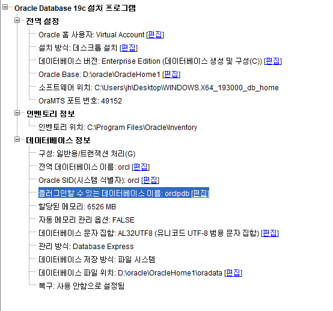

## 1. 설치

* 오라클 베이스 : D:\oracle\OracleHome1
* 오라클 데이터베이스 파일 위치 : D:\oracle\OracleHome1\oradata
* 전역 데이터 베이스 이름 : orcl
* 비밀번호 : Dlrjsgh82!



> 설치시 주의사항
>
> - setup.exe 를 관리자 권한으로 실행한다. 
> - 컨테이너 데이터 베이스 생성 부분의 체크를 해제하고 진행한다.

## 2. 삭제

### 환경 변수 삭제

중요하고 권장된다. 

윈도우 + Q 단축키로 검색 유틸리티를 실행한다. `환경변수편집` 프로그램을 찾고 실행한다. 시스템 변수 섹션으로 간다. 

Path 변수를 확인하면 오라클 홈의 bin디렉터리를 확인할 수 있다. 필자의 경우 ``였다.

### 레지스트리 삭제

특별히 주의하여 삭제한다.

아래 오라클 관련된 레지스트리 항목이 삭제 대상이다. 

#### 레지스트리 항목

1. 

해당 목록은 레지스트리의 아래 경로에서 찾을 수 있다.

```
HKEY_LOCAL_MACHINE\SYSTEM\CurrentControlSet\Services
HKEY_LOCAL_MACHINE\SOFTWARE
```

다른 항목을 건드리지 않도록 주의하며 잘 삭제한다.

### 재부팅

레지스트리 삭제 후 재 부팅 한다.

### 오라클 유저 그룹 삭제

14개의 오라클 유저 그룹이 있다.

윈도우 실행에서 다음 명령어를 입력하면 유저 관리 화면이 나타난다. 

```
lusrmgr.msc
```

만약 오라클 설치 시에 특정 사용자를 추가하였다면 사용자 폴더에가서 해당 사용자를 지운다.

그 후, 그룹 폴더로 가서 14개의 오라클 유저 그룹을 삭제한다.

### 오라클 데이터베이스 삭제

1. oracle home
2. oracle base

위의 2가지 항목을 삭제한다.


