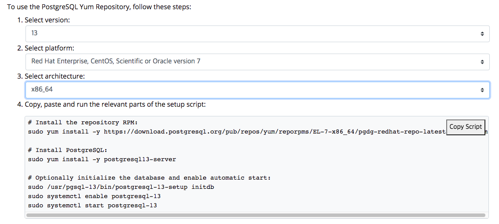

# PostgreSQL 설치

## CentOS 계열

postgresql은 yum 리포지토리를 제공하기 때문에 간편하게 설치할 수 있다.

다음 [링크](https://www.postgresql.org/download/linux/redhat/) 를 방문하면 yum을 이용하여 설치할 수 있는 방법을 알 수 있다. 아래 그림과 같이 PostgresSQL버전, 설치하려는 OS버전, CPU 아키텍처를 설정하면 바로 아래 스크립트가 나온다. 



아래와 같이, 자동으로 생성되는 스크립트를 입력하면 쉽게 설치가 된다.

```bash
sudo yum install -y https://download.postgresql.org/pub/repos/yum/reporpms/EL-7-x86_64/pgdg-redhat-repo-latest.noarch.rpm
sudo yum install -y postgresql13-server
sudo /usr/pgsql-13/bin/postgresql-13-setup initdb
sudo systemctl enable postgresql-13
sudo systemctl start postgresql-13
```

명령어를 해석해보면: 

* `-y`: 모든 질문에 yes라고 대답한다

* pgdg-redhat-repo를 설치한다. 뭐하는 녀석인가?

* postgresql13-server 를 설치한다. 아래 항목이 설치된다. 

  ```
  Installing : postgresql13-libs-13.1-1PGDG.rhel7.x86_64
  Installing : postgresql13-13.1-1PGDG.rhel7.x86_64
  Installing : postgresql13-server-13.1-1PGDG.rhel7.x86_64
  ```

* postgresql-13-setup initdb: db를 초기화한다. 

* sudo systemctl enable postgresql-13: 서비스로 등록한다.

* start postgresql-13 : 서비스를 시작한다. 

* systemctl status postgresql-13으로 서비스가 동작하는 것을 확인한다. 

* 실행파일과 데이터 디렉토리는 다음과 같다. 

  ```bash
  /usr/pgsql-13/bin/postmaster -D /var/lib/pgsql/13/data/
  ```

* 데이터 디렉토리는 postgres 계정으로 생성되어 있다. 

아래 패키지를 추가로 설치할 수 있다. 

| postgresql-client  | libraries and client binaries                    |
| ------------------ | ------------------------------------------------ |
| postgresql-server  | core database server                             |
| postgresql-contrib | additional supplied modules                      |
| postgresql-devel   | libraries and headers for C language development |
| pgadmin4           | pgAdmin 4 graphical administration utility       |

오프라인 설치를 위해 rpm 패키지를 다음 [링크](https://yum.postgresql.org/rpmchart/)에서 받을 수 있다.

## 서버 관리

/etc/passwd 파일을 보자. 가장 마지막에 postgres라는 계정이 생성되어 있는 것을 확인할 수 있다. 아! postgresql을 설치하면 자동으로 postgres라는 계정이 생성되는구나. 그런데 비밀번호는 뭐지? 비밀번호를 모르기 때문에 직접 비밀번호를 변경한다. 

```bash
sudo passwd postgres
```

postgres 계정으로 로그인 하자. 

```bash
su - postgres
```

postgres 계정으로 로그인을 하면 psql, createdb와 같은 postgresql 명령어를 사용할 수 있다.

### Role

Role은 [여기](role.md)에서 자세히 다룬다. 

운영체제의 postgres 유저로 로그인 한 후 psql 명령어를 사용하면 별도로 role을 명시하지 않았기 때문에 유저명과 동일한 postgres role로 데이터베이스에 접속한다. 별도의 role을 주고 싶다면 `-U` 옵션을 사용한다. 

```sqlite
psql
> postgres=#
```

postgres role의 비밀번호를 변경하려면 다음 명령어를 사용하자. (운영체제의 postgres와 혼동하지 말자)

```bash
psql -d template1 -c "ALTER USER postgres WITH PASSWORD 'NewPassword';"
```

### 계정 및 데이터베이스 생성

sql 방식과 커맨드라인 방식이 있다. 커맨드 방식은 `/usr/pgsql-${version}/bin` 에 있는 바이너리를 활용한다. 

새로운 데이터베이스와 role을 생성한다.

커맨드라인 방식:

```bash
// role을 생성한다
$ createuser testrole -P 

// 데이터베이스를 생성한다. 
$ createdb testdb

// 데이터베이스를 생성하며 특정 role을 오너로 줄 수 있다.
$ createdb testdb -O testrole
```

sql방식:

```sql
create role testrole
```


롤과 데이터베이스 삭제는 다음과 같이 한다. 

커맨드라인방식:

```bash
$ dropdb testdb
$ dropuser testrole
```

sql방식;

```sql
DROP ROLE name;
```


### 컨넥션 및 보안 설정

기본적으로 접속은 localhost에서만 가능하게 되어 있다. 외부(다른 머신)에서도 접속할 수 있도록 하려면

`/var/lib/pgsql/13/data/postgressql.conf` 파일을 수정한다. 수정하고 서버를 다시 시작해야 한다.

```
listen_addresses = 'localhost'
```

콤마(,) 구분자로 여러개의 ip를 설정할 수 있다. `*`을 이용하면 전체 범위의 ip주소를 설정할 수 있다. `0.0.0.0` 을 설정하면 모든 ip v4 주소를 허용한다. `::` 는 모든 ip v6 주소를 허용한다. 값이 비어 있다면 모든 ip의 접속을 허용하지 않는다.

기본 port 는 5432이다. 

>  주의: 리눅스의 경우 외부에서 접속하기 위해서는 5432포트를 방화벽에서 해제해야 한다. 

외부 호스트에서 접속시 아래와 같은 오류 메세지가 발생할 수 있다. 아니, 최초 설정한다면 거의 발생한다고 봐야 한다. 

```
The specified database user/password combination is rejected: [28000] FATAL: no pg_hba.conf entry for host "{클라이언트 주소}", user "{계정}", database "{데이터베이스}", SSL off
```

원인은 외부의 접속 권한을 pg_hba.conf 에 설정하는데 접속하고자하는 클라이언트의 주소가 해당 파일에 명시되지 않았기 때문이다. 이와 관련한 자세한 설명은 [링크](https://www.postgresql.org/docs/current/auth-pg-hba-conf.html)를 참조하자. `/var/lib/pgsql/13/data/pg_hba.conf` 파일을 열어 접속 가능한 클라이언트 주소를 추가한다. 이 파일을 수정한 후 서버를 다시 시작해야 한다.

```
# TYPE  DATABASE        USER            ADDRESS                 METHOD

# "local" is for Unix domain socket connections only
local   all             all                                     peer
# IPv4 local connections:
host    all             all             127.0.0.1/32            scram-sha-256
host    all             all             192.168.1.0/24          trust
```

다음 링크(https://www.postgresql.org/docs/13/user-manag.html) 참조

### 접속하기

JDBC드라이버로 DB작업을 진행할 수 있는 dbeaver를 설치하여 진행한다. [링크](https://dbeaver.com/download/)에서 다운받아 설치하자.

> 참고 : jdbc 컨텍션 스트링은 다음과 같다.
>
> jdbc:postgresql://host:port/database


# 참조

postgres 공식 홈페이지

https://www.hostinger.com/tutorials/how-to-install-postgresql-on-centos-7/