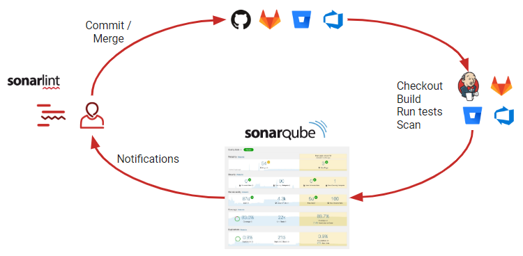

# 개요

소나큐브는 버그를 자동으로 찾기 위한 도구이다. 아래 그림과 같이 우리가 작성한 코드를 commit/merge 하면 형상관리 툴에 저장이되고 젠킨스와 같은 CI/CD도구가 코드를 컴파일/빌드하고 소나큐브에 검사를 의뢰하게 된다. 



소나큐브는 코드를 검사하고 그 결과를 웹UI를 통하여 리포팅한다. 개발자는 소나큐브가 제공하는 웹UI에 접속하여 자신의 코드에 대한 인스펙션 결과를 확인할 수 있고 프로젝트 관리자는 이것을 통하여 프로그램적인 오류를 사전에 해결할 수 있다.

소나큐브는 커뮤니티 버전이 존재하며 무료로 사용할 수 있다. 또한 직접 설치를 할 수 있기 때문에 페쇄적인 환경이라면 내부에 설치하여 서비스할 수 있다. 

이번 포스팅은 소나큐브를 커뮤니티 버전을 설치하는 과정을 다뤄보겠다.

# 설치

소나큐브는 다음 3가지로 구성되어 있다. 

* 스캐너
* 소나큐브 서버
* 데이터베이스 서버


### 호스트와 위치

소나큐브 서버와 데이터 베이스는 별도의 호스트로 분리하는 것이 성능상 좋다고 한다. 

### 데이터 베이스 설치

소나큐브는 다음 3가지 데이터 베이스를 사용할 수 있다. 필자는 소나큐브를 설치하기 위해 PostgreSQL을 설치하였다. 왜냐하면 무료이기 때문이다.

* Microsoft SQL Server
* Oracle
* PostgreSQL

PostgreSQL설치를 한 후 sonar라는 이름의 database와 sonar라는 이름의 role(또는 유저)을 미리 생성한다. 소나큐브는 이 role과 database를 사용할 것이다.

### ZIP파일로 소나큐브 설치하기

이 방법은 소나큐브 홈페이지에서 zip파일을 받아 설치하는 방법이다. 요새는 도커를 이용하여 설치하는 방법도 많이 추천되니 도커를 통하여 설치하고자 한다면 이부분은 생략하고 아래 도커 설치 방법을 확인한다.

설치하기 전에 다음 요구사항을 체크하자. 간단히 JDK만 있으면 된다. 

* Oracle JRE 11 or OpenJDK 11

[소나큐브 홈페이지의 설치파일](https://www.sonarqube.org/success-download-community-edition/) 을 받아 압축을 해제하자.(숫자로 시작하는 폴더명을 사용하지 말자)

소나큐브는 root계정을 실행할 수 없으니 적절한 계정을 생성하자.

*$SONARQUBE-HOME(홈폴더)* 는 위의 파일이 압축이 풀린 폴더를 가리킨다.

#### 데이터 베이스 접속

*$SONARQUBE-HOME/conf/sonar.properties*를 설정한다. 

소나큐브에는 이미 데이터베이스 JDBC드라이버가 있으니 일부러 변경하지 말자. (단, 오라클은 직접 넣어야한다)

오라클은 알맞은 드라이버를 *$SONARQUBE-HOME/extensions/jdbc-driver/oracle* 에 복사하자.

#### 엘라스틱 서치를 위한 저장소 설정

기본으로 *$SONARQUBE-HOME/data* 로 설정되어 있지만, 별도의 빠른 I/O가 가능한 경로로 변경하는 것을 추천한다. 

*$SONARQUBE-HOME/conf/sonar.properties* 파일의 다음 항목을 변경한다. 

```
sonar.path.data=/var/sonarqube/data
sonar.path.temp=/var/sonarqube/temp
```

#### 웹 서버 시작

기본 포트는 9000이고 컨텍스트 패스는 `/` 이다. *$SONARQUBE-HOME/conf/sonar.properties* 를 수정하여 변경할 수 있다. 

```
sonar.web.host=192.0.0.1
sonar.web.port=80
sonar.web.context=/sonarqube
```

다음 스크립트를 실행하자. 

* On Linux: bin/linux-x86-64/sonar.sh start
* On macOS: bin/macosx-universal-64/sonar.sh start
* On Windows: bin/windows-x86-64/StartSonar.bat

기본 운영자 계정은 admin/admin이다.

#### Java 버전 적용하기

만약 서버에 여러 버전의 자바가 설치되어 있다면 알맞은 자바 버전을 설정해야 한다. 

*$SONARQUBE-HOME/conf/wrapper.conf* 파일을 수정한다. 

```
wrapper.java.command=/path/to/my/jdk/bin/java
```

### 도커 이미지로 설치하기

#### 일반적인 방법

1. 도커 이미지의 특성상 데이터를 유실하지 않기 위해 볼륨 설정을 한다. 

   * `sonarqube_data` – 엘라스틱 서치 인덱스, H2 데이터베이스를 위한 데이터 파일
   * `sonarqube_logs` – 소나큐브 로그(접속, 웹 프로세스, CE프로세스, 엘라스틱서치)
   * `sonarqube_extensions` – 설치한 플러그인과 오라클 JDBC

   다음 명령어로 도커 볼륨을 생성하자.

   ```bash
   $> docker volume create --name sonarqube_data
   $> docker volume create --name sonarqube_logs
   $> docker volume create --name sonarqube_extensions
   ```

> 주의: 위의 커맨드로 볼륨을 설정하는 것을 명심해라. bind mount를 사용하지 말라. 플러그인 관련된 문제가 발생할 수 있다.

2. 오라클을 제외하고 데이터베이스 드라이버는 이미 제공되고 있다. 만약에 오라클을 사용한다면 sonarqube_extensions 폴더에 oracle jdbc드라이버를 설치해야 한다. 이를 위해 다음 단계를 따라하자. 

   * 임베디드 h2 데이터베이스를 사용하는 소나큐브 도커 컨테이너를 일단 시작

   ```bash
   $ docker run --rm \
       -p 9000:9000 \
       -v sonarqube_extensions:/opt/sonarqube/extensions \
       <image_name>
   ```

   * 일단 시작됐으면 그냥 끈다.
   * `sonarqube_extensions/jdbc-driver/oracle` 에 오라클 JDBC 드라이버를 복사한다.

3. -e 환경변수를 사용하여 도커 컨테이너를 기동한다. 

```bash
$> docker run -d --name sonarqube \
    -p 9000:9000 \
    -e SONAR_DBC_URL=... \
    -e SONAR_JDBC_USERNAME=... \
    -e SONAR_JDBC_PASSWORD=... \
    -v sonarqube_data:/opt/sonarqube/data \
    -v sonarqube_extensions:/opt/sonarqube/extensions \
    -v sonarqube_logs:/opt/sonarqube/logs \
    <image_name>
```

> 위의 환경 변수는 추후 사라질 것이다. 

#### 도커 컴포즈를 사용하는 경우

일반적인 사용방법의 1번과정과 2번 과정은 똑같이 진행하고 도커 컴포즈로 실행하기 위한 yml파일을 작성한다.

```yaml
version: "3"

services:
  sonarqube:
    image: sonarqube:8-community
    depends_on:
      - db
    environment:
      SONAR_JDBC_URL: jdbc:postgresql://db:5432/sonar
      SONAR_JDBC_USERNAME: sonar
      SONAR_JDBC_PASSWORD: sonar
    volumes:
      - sonarqube_data:/opt/sonarqube/data
      - sonarqube_extensions:/opt/sonarqube/extensions
      - sonarqube_logs:/opt/sonarqube/logs
      - sonarqube_temp:/opt/sonarqube/temp
    ports:
      - "9000:9000"
  db:
    image: postgres:12
    environment:
      POSTGRES_USER: sonar
      POSTGRES_PASSWORD: sonar
    volumes:
      - postgresql:/var/lib/postgresql
      - postgresql_data:/var/lib/postgresql/data

volumes:
  sonarqube_data:
  sonarqube_extensions:
  sonarqube_logs:
  sonarqube_temp:
  postgresql:
  postgresql_data:
```

이 yml파일에서는 postgreSQL도 도커 이미지로 설치하는 것으로 진행하고 있다. 만약 필자와 같이 postgreSQL또는 다른 데이터베이스를 설치하였다면 db관련된 부분은 작성해서는 안된다. 또한, `jdbc:postgresql://db:5432/sonar` 값도 실제 설치된 데이터베이스의 정보가 입력되어야 한다.

yml파일이 저장되어 있는 폴더로 가서 다음 명령어를 실행하자. 백그라운드 방식으로 실행하기 위해 -d옵션을 붙였다.

```bash
docker-compose up -d
```

#### 메모리 오류가 발생하는 경우

컨테이너가 시작되지 않을 수 있다. 원인을 찾아보니 다음과 같다. 

```
sonarqube_1  | ERROR: [1] bootstrap checks failed
sonarqube_1  | [1]: max virtual memory areas vm.max_map_count [65530] is too low, increase to at least [262144]
```

운영체제에 설정된 vm 메모리가 너무 작기 때문이란다. 해결 하기 위해 다음 명령어로 값을 수정한다. 

```
sysctl -w vm.max_map_count=262144
```

하지만, 위의 명령어는 일시적이다. 운영체제를 재부팅하면 다시 원래의 설정으로 돌아간다. 영구적으로 적용하기 위해서는  `/etc/sysctl.conf` 을 수정한다. 다음 항목을 추가하자. 

```
vm.max_map_count = 262144.
```

파일을 수정 후 `sysctl -p` 명령으로 설정을 적용하고 다시 도커 이미지를 시작하자.

### 접속하기

웹브라우저에서 다음 주소를 입력해보자.

```
http://{설치된머신의IP}:9000/
```

다음과 비슷한 화면이 나오면 설치 성공이다. 


#### 관리자로 접속하기

소나큐브는 다음과 같이 초기 관리자 계정과 비밀번호를 제공한다.

```
Default Admin Credentials
When installing SonarQube, a default user with Administer System permission is created automatically:

Login: admin
Password: admin
```

### 플러그인 설치

플러그인 설치는 2가지 방법있다. 

#### 마켓플레이스에서 설치

소나큐브가 설치되어 있는 머신이 인터넷과 연결되어 있다면 소나큐브 웹UI를 통해서 설치할 수 있다.

#### 수동 설치

소나큐브가 인터넷에 연결되지 않은 경우 사용하는 방법이다. 또는 자신이 직접 소나큐브 플러그인을 만들었다면 마켓플레이스에 올리기 전에 미리 설치하는 경우에도 사용한다. 

먼저, 플러그인 문서 페이지를 방문하여 플러그인 메뉴얼 다운로드 링크를 찾는다. 링크를 통하여 플러그인을 받는다. 플러그인은 보통 jar파일이다. 이 파일을 *$SONARQUBE-HOME/extensions/downloads* 에 놓은 후, 소나큐브를 재시작한다.

#### 인터넷에 접속이 안될 때 추가로 하는 일

인터넷에 접속이 안되는 상황에서 소나큐브는 기본적으로 마켓플레이스로 접속을 시도한다. 이런 경우 소나큐브에 오류 로그가 계속 남는다. 이런 경우, 마켓플레이스 접속 기능을 비활성화하는 것이 좋다. 

*$SONARQUBE-HOME/conf/sonar.properties* 파일의 `sonar.updatecenter.activate`  항목을 수정하자.

## 소스코드 분석하기

일단 소나큐브(서버)가 설치가 되면, 우리는 스캐너를 설치할 준비가 된 것이며 프로젝트를 생성할 수 있다. 이를 위해, 스캐너를 설치하고 설정해야 한다. 

우리가 사용하는 빌드 툴에 따라 다음과 같이 다양한 스캐너가 지원되고 있다. 

- Gradle - [SonarScanner for Gradle](https://docs.sonarqube.org/latest/analysis/scan/sonarscanner-for-gradle/)
- MSBuild - [SonarScanner for MSBuild](https://docs.sonarqube.org/latest/analysis/scan/sonarscanner-for-msbuild/)
- Maven - use the [SonarScanner for Maven](https://docs.sonarqube.org/latest/analysis/scan/sonarscanner-for-maven/)
- Jenkins - [SonarScanner for Jenkins](https://docs.sonarqube.org/latest/analysis/scan/sonarscanner-for-jenkins/)
- Azure DevOps - [SonarQube Extension for Azure DevOps](https://docs.sonarqube.org/latest/analysis/scan/sonarscanner-for-azure-devops/)
- Ant - [SonarScanner for Ant](https://docs.sonarqube.org/latest/analysis/scan/sonarscanner-for-ant/)
- anything else (CLI) - [SonarScanner](https://docs.sonarqube.org/latest/analysis/scan/sonarscanner/)

> 소나큐브는 깃헙과 같은 잘 알려진 ALM 사이트에서도 연계를 지원한다.

프로젝트는 처음으로 분석이 이뤄지면 자동으로 생성된다. 만약 첫 분석전에 프로젝트에 대한 설정이 필요하다면, 관리자 권한으로 미리 프로젝트를 생성할 수 있다. 

### 소나 스캐너 (메이븐)

분석하고자하는 소스가 메이븐 프로젝트로 구성되어 있다면, 메이븐 빌드 사이클에서 소나큐브러너를 실행할 수 있다. 메이븐이 자동으로 소나큐브라이브러리를 받기 때문에 별도의 설치나 라이브러리 다운로드가 필요없다. 그래서 매우 편하다.

#### 필요사항

메이븐 3.x

#### 전역 설정

소나큐브 플러그인과 소나큐브 서버 정보를 입력하기 위해 $MAVEN_HOME/conf/setting.xml파일을 수정한다. 

```xml
<settings>
    <pluginGroups>
        <pluginGroup>org.sonarsource.scanner.maven</pluginGroup>
    </pluginGroups>
    <profiles>
        <profile>
            <id>sonar</id>
            <activation>
                <activeByDefault>true</activeByDefault>
            </activation>
            <properties>
                <!-- Optional URL to server. Default value is http://localhost:9000 -->
                <sonar.host.url>
                  http://myserver:9000
                </sonar.host.url>
            </properties>
        </profile>
     </profiles>
</settings>
```

#### 분석 하기

분석하고자하는 메이븐 프로젝트에서 다음과 같이 입력한다. 

```bash
$ mvn clean verify sonar:sonar
```

#### 분석 설정 하기

분석 대상 프로젝트 pom.xml파일을 수정하여 분석 설정을 할 수 있다. 

```xml
<properties>
  <sonar.buildString> [...] </sonar.buildString>
</properties>
```

#### 메이븐 플러그인 버전 고정

프로젝트 pom.xml을 수정하여 소나큐브 메이븐 플러그인의 버전을 고정(프로젝트 별로 설정)할 수 있다. 

```xml
<build>
  <pluginManagement>
    <plugins>
      <plugin>
        <groupId>org.sonarsource.scanner.maven</groupId>
        <artifactId>sonar-maven-plugin</artifactId>
        <version>3.7.0.1746</version>
      </plugin>
    </plugins>
  </pluginManagement>
</build>
```

### 젠킨스 에서 분석하기

젠킨스를 위한 소나큐브 플러그인이 있다. ([링크](https://plugins.jenkins.io/sonar/) 에서 다운 가능)

이 플러그인을 이용하여 소나큐브와 관련된 설정을 젠킨스에서 하고 소나큐브 분석을 실행할 수 있다.  

### 소나 스캐너 설정하기

대상 프로젝트의 루트 디렉토리에 `sonar-project.properties` 파일을 생성한다. 

# 출처

https://docs.sonarqube.org/