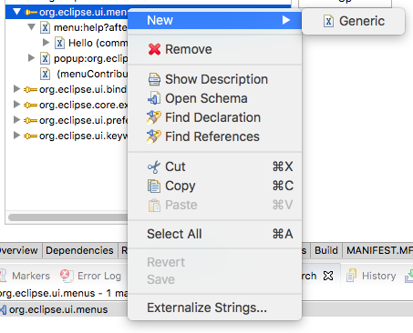
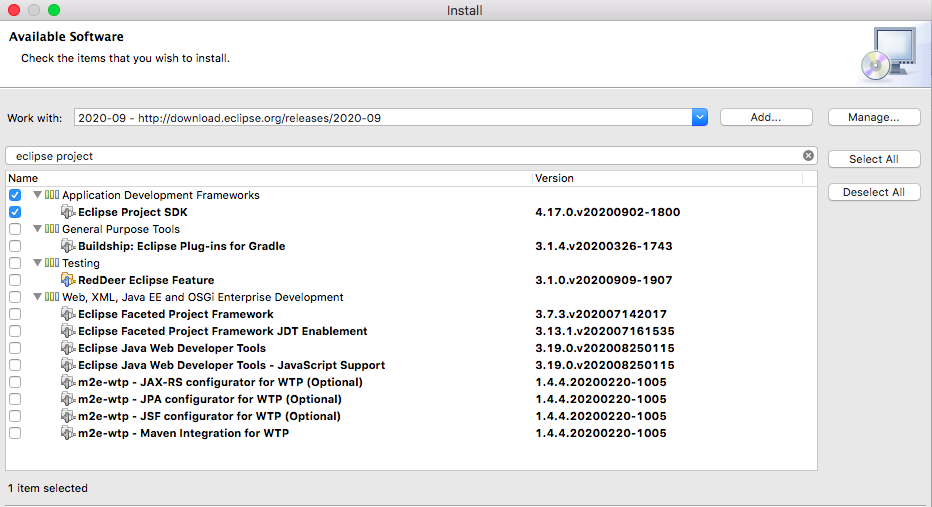
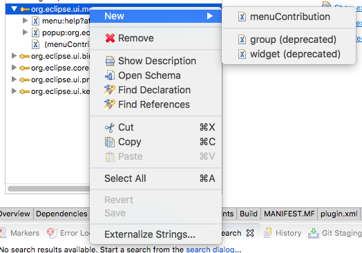

## 익스텐션 스키마 확인하기

이클립스 플러그인을 개발하면 이클립스에서 제공하는 익스텐션(extension)을 사용하게 된다. 그런데 사용하려는 익스텐션에서 어떤 스키마를 제공하는지 알 수 없다. 그래서 이클립스에서 사용가능한 스키마를 보여주는데 안보이는 경우가 있다. 아래 그림과 같이 익스텐션에서 New를 할때 추가 가능한 항목이 나와야 하는데 그렇지 않는다.   

원인은 이클립스 플러그인 개발에 필요한 도구가 설치되지 않았기 때문이다. 그 도구는 eclipse project SDK이다. 아래와 같이 이클립스 플러그인 설치화면에서 Eclipse Project SDK 찾아 설치한다.

설치가 정상적으로 진행되면 다음과 같이 사용가능한 스키마 항목이 나타난다.

