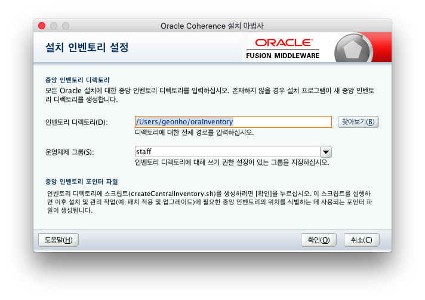
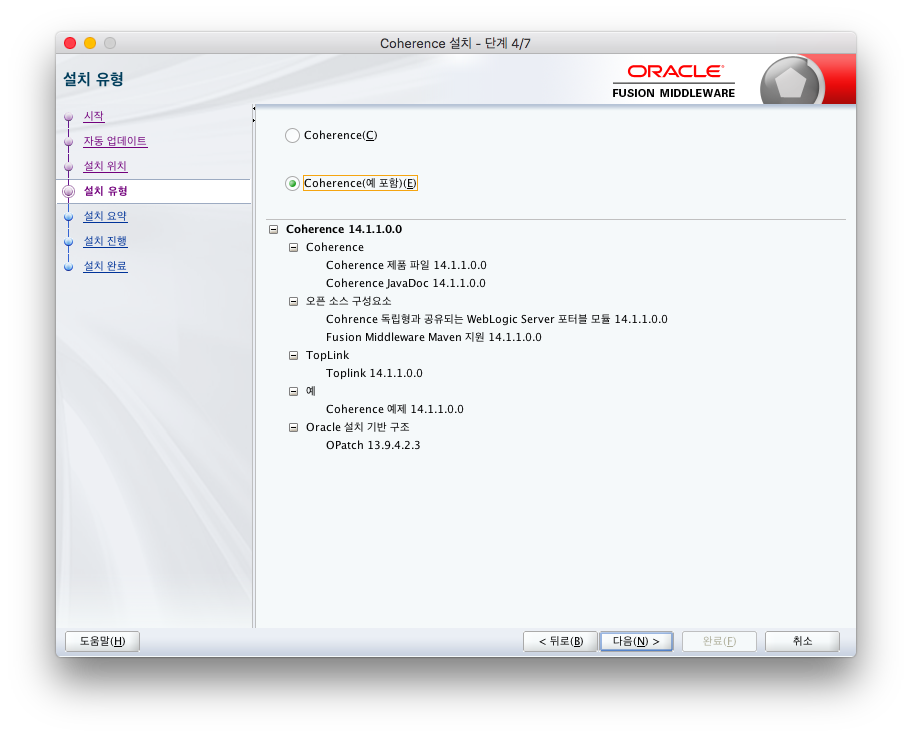
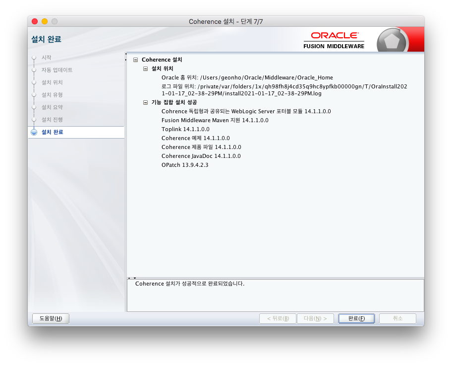

오라클에서 제공하는 in-memory 캐시 서비스인 coherence를 설치하는 내용.

## 코히어런스(coherenece) 란?

오라클에서 제공하는 in-memory DB 이다. 다른 말로는 캐시 서버라고도 한다. 

## 설치

만약 weblogic이 설치되어 있다면 코히어런스도 이미 설치되어 있기 때문에 별도의 설치가 필요 없다. 만약 weblogic과 별개로 사용 하려면 설치가 필요하다. 이 포스팅은 웹로직이 설치되지 않은 환경에서 코히어런스를 설치하는 것에 대해서 다룬다.

그런데 필자가 코히어런스를 직접 설치하게 된 이유가 있다. 필자가 알기론 코히어런스는 웹로직을 사용하는 경우에만 사용한다. 왜냐하면 웹로직과 코히어런스는 오라클에서 제공하는 미들웨어 제품군으로 함께 사용하게 되면 호환성이 매우 좋으며 캐시 서비스를 쉽게 구성할 수 있기 때문이다. 필자가 개발하는 환경도 웹로직과 코히어런스 환경에서 개발을 진행하였다.

다만, 일반적으로 로컬 개발환경은 톰캣으로 진행하는데 모든 개발자 PC에 웹로직을 설치할 수 없기 때문이다. 톰캣과 코히어런스의 연동을 테스트하기 위해서는 로컬PC에 코히어런스를 설치해보고 동작을 확인할 필요성이 생겼다. 또한, 로컬 개발환경에 코히어런스가 없다면 매번 기능을 테스트하기 위해 소스를 수정하고 코히어런스가 설치된 개발 서버에 배포해야 하는 작업이 필요한데 이것은 굉장히 번거러운 일이다. 

### 라이센스 정책 

> 정확한 것은 아니지만 필자가 알기론 coherenece는 weblogic라이센스를 구매하면 무료로 사용할 수 있지만 weblogic이 없이 단독으로 사용하기 위해서는 상응하는 라이센스를 구매를 해야 한다. 만약 상업적인 용도로 사용하려면 라이센스 정책을 정확히 확인하여야 한다.

### 설치파일 다운로드

[Coherence Stand-Alone Install](https://download.oracle.com/otn/nt/middleware/14c/14110/fmw_14.1.1.0.0_coherence_Disk1_1of1.zip) 에서 최신버전의 coherence를 받는다. 이 글을 쓰는 시점의 최신버전은 `14.1.1`이다. `fmw_14.1.1.0.0_coherence_Disk1_1of1.zip` 파일을 받게 되는데 압축을 해제하면 `fmw_14.1.1.0.0_coherence.jar` 파일을 얻을 수 있다.

### JDK 준비

Coherence는 오라클 jdk에서만 설치가 가능하고 설치 후에는 다른 jdk로 구동해도 상관없는 것 같다. 그렇기 때문에 Coherence를 설치하기 전에 오라클 jdk를 미리 설치하자. 혹시 Mac에서 다른 버전의 jdk를 설치하려면 필자의 관련 포스팅 [Mac OS에 하나 이상의 다른 버전의 JDK 설치하기](../macos/2021-01-16-java-install.md) 를 참조하자.

### 설치 라이브러리 실행

fmw_14.1.1.0.0_coherence.jar 파일이 있는 폴더로 이동하여 다음 명령어를 실행한다.

```bash
$ java -jar fmw_14.1.1.0.0_coherence.jar
```

그럼 아래 그림과 같이 설치 GUI가 나타난다. (오라클 JDK를 사용해야만 이런 GUI를 쓸 수 있다고 한다)



필자는 Coherence의 정확한 지식이 없어 기본 설정으로 설치를 하였다. (확인, 다음 버튼만 계속 눌렀다)

아래 그림에서 예제 파일도 확인할 수 있도록 체크한다. 



아래 그림과 같이 완료가 되면 설치 성공!



드디어 Mac에 Coherece를 설치하였다.

## 설치 된 디렉토리 둘러보기

설치를 하였더니 유저 홈 디렉토리에 아래와 같이 2개의 폴더가 생성되었다. 필자의 경우 기본 설정을 그대로 따른 경우 이고 설치경로를 변경하였다면 변경된 경로로 디렉터리가 생성되었을 것이다. 

```bash
drwxr-x---   3 geonho  staff     96  1 17 14:48 Oracle
drwxrwx---   7 geonho  staff    224  1 17 14:48 oraInventory
```

우리가 관심가져야 할 폴더는 `/Users/geonho/Oracle/Middleware/Oracle_Home/coherence`이다. 이 폴더가 coherence 애플리케이션의 home 디렉토리이다. coherence는 COHERENCE_HOME이란 환경변수에 이 경로를 할당하여 사용한다.  

이 디렉터리는 아래와 같이 구성되어 있는데,

```bash
drwxr-x---   9 geonho  staff   288B  1 17 14:49 bin
drwxr-x---   4 geonho  staff   128B  1 17 14:49 doc
drwxr-x---   8 geonho  staff   256B  1 17 14:49 examples
drwxr-x---  26 geonho  staff   832B  1 17 14:49 lib
drwxr-x---   5 geonho  staff   160B  1 17 14:49 plugins
-rw-r-----   1 geonho  staff   100B 11 21  2019 product.xml
```

bin폴더와 lib폴더는 애플리케이션 구동에 필요한 것으로 보이고 doc, examples은 도움을 줄 수 있는 문서와 샘플인것 같다.

## 설정 이해하기

`$COHERENCE_HOME/lib/coherence.jar` 파일에 coherence의 기본설정을 담고 있는 파일이 있다. 

- `tangosol-coherence.xml` – 런타임시 동작에 대한 설정이다. 클러스터 생성과 설정, 데이터 관리 서비스의 생성과 설정을 한다. 자세한 건 모르겠고 coherence 동작에 관련한 기본 설정이 모두 여기에 들어가 있다고 생각하자.
- `tangosol-coherence-override-dev.xml` – `tangosol-coherence.xml` 파일의 설정을 오버라이드 한다. 개발 모드일 경우에 적용된다. 기본 설정으로 Coherence는 개발 모드로 시작되고 이 파일의 설정이 적용된다.
- `tangosol-coherence-override-eval.xml` – `tangosol-coherence.xml` 파일의 설정을 오버라이드 한다. eval 모드일 경우 적용된다.
- `tangosol-coherence-override-prod.xml` – `tangosol-coherence.xml` 파일의 설정을 오버라이드 한다. prod 모드일 경우 적용된다.
- `coherence-cache-config.xml` – 클러스터에서 사용 될 수 있는 캐시를 설정한다. 보통 이 파일은 cache configuration deployment descriptor로 역할을 한다.
- `coherence-pof-config.xml` – 우리가 직접 작성한 클래스의 객체를 저장할 때 직렬화를 거치게 되는데 이 직렬화와 관련된 파일로 보인다.
- Management configuration files – Coherence management reports를 설정하는 파일 셋이다. 이 파일은 `coherence.jar`의  `/reports`  폴더에 있다. 제세한 건 필자도 모른다.

처음부터 모든 설정을 알아야하는 것은 아니다. 우선, `coherence-cache-config.xml` 파일을 보자. cache-name이 `*` 로 설정되어 있는 것으로 보아, coherence 캐시 설정은 기본적으로 어떤 이름의 캐시라도 사용할 수 있도록 하는 것을 알 수 있다. 이 값을 변경하면 특정 이름의 캐시만 사용 할 수 있도록 제약을 줄 수있다.

```xml
  <caching-scheme-mapping>
    <cache-mapping>
      <cache-name>*</cache-name>
      <scheme-name>${coherence.profile near}-${coherence.client direct}</scheme-name>
    </cache-mapping>
  </caching-scheme-mapping>
```

## 캐시 서버 기동하기

$COHERENCE_HOME/bin 폴더에 가면 cache-server.sh 파일을 볼 수 있다. 이 파일은 쉘 스크립트 파일인데 coherence 캐시 서버를 구동하는 기본적인 명령어가 기술되어 있다. 이 스크립트를 실행해보자.

```bash
$ ./cache-server.sh
```

다수의 로그가 나오고 마지막에 `Started DefaultCacheServer...` 메세지가 나타나면 기동에 성공한 것이다. 확인하였는가? 우리는 처음으로 coherence cache server를 기동하였다.

캐시 서버를 기동했지만 이 상태에서 특별히 더 할 것이 없다. 캐시 서버에 데이터를 입력하고 조회하는 기본적인 작업을 하기위해 캐시 팩토리를 기동해야 한다.

## 캐시 팩토리 기동하기

캐시 서버 터미널은 그대로 두고 새로운 터미널을 열어 $COHERENCE_HOME/bin 폴더에 가면 coherence.sh 파일을 볼 수 있다. 이 파일도 쉘 스크립트 파일인데 내용은 cache-server.sh 파일과 거의 비슷하다. 이 스크립트가 캐시 팩토리를 기동하는 스크립트이다.  스크립트를 실행해보자.

```bash
$ ./coherence.sh
```

아래와 같이 `Map (?):` 프롬프트가 나타나고 커서가 깜빡거리면 캐시팩토리가 정상적으로 기동된 것이다.

````bash
Map (?):
````

이 프롬프트에서 cache my 를 입력해보자. 프롬프트가 `Map (my):` 로 바뀔 것이다. 이 과정에서 어떤 일이 일어났는지 알아야 할 필요가 있다. 

먼전, 캐시팩토리는 기동하면서 console 명령어를 입력받을 수 있는 상태가 되었다. 그 후 입력한 cache라는 명령어는 특정 cache를 선택하고 그 cache에서 명령을 수행한다는 의미이다. 그래서 프롬프트의 ?가 my로 바뀌었다. my는 cache의 이름이다. coherence cache config를 설명할 때 기본 설정은 어떤 이름도 cache로 사용가능하도록되어 있다고 설명했기 때문에 my라는 이름의 cache도 아무 제약없이 사용할 수 있는 것이다. 

이제 데이터를 한번 등록해보자. 다음 명령어를 입력해보자.

```bash
Map (my): put key1 value1
```

 이 명령어는 키가 key1이고 그 값이 value1이라는 데이터를 캐시에 등록한다. 이 값을 조회하기 위해 get 명령어를 사용할 수 있다.

```bash
Map (my): get key1
value1
```

결과로 value1을 확인할 수 있다.

이 상태에서 또 하나의 캐시 팩토리를 기동하자. 터미널을 새로 열고 coherence.sh를 실행하면 새로운 캐시팩토리가 생성된다. 이 상태에서 `cache my` 명령어로 기존 생성된 캐시로 들어간 후 `get key1` 명령어를 입력해보자. value1 결과가 보인다. 

캐시 서버 1개, 캐시 팩토리 2개를 기동하여 3개의 인스턴스가 동일한 캐시 데이터를 공유하는 것을 확인하였다. 

콘솔창에 나타나는 로그를 보며 눈치챘겠지만 하나의 캐시 팩토리가 조인할 때 마다 캐시 서버 로그에서 새로운 맴버가 조인했다는 것을 알려준다.

## 마무리

지금까지 coherence를 설치하고 기본 동작을 확인하였다. 하지만, 이제 시작일 뿐이다. 이것을 제대로 활용하기 위해서는 설정하는 방법, 동작하는 원리 등 정말 알아야 할 것이 많다. 다 이해 할 수는 없겠지만 잘 활용할 수 있도록 기본적인 것들을 하나씩 정리해야겠다.

## 참조

https://docs.oracle.com/en/middleware/fusion-middleware/index.html

https://docs.oracle.com/middleware/1212/coherence/COHDG/gs_install.htm#COHDG4996

